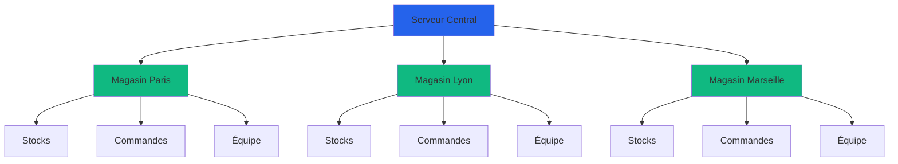
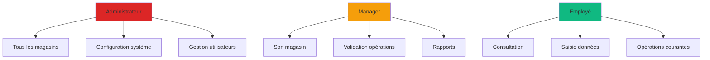

# Documentation API - Système de Gestion Logistique

> Documentation complète du système de gestion logistique pour réseaux de magasins

---

## Bienvenue

Cette documentation couvre l'ensemble des fonctionnalités de l'application de gestion logistique. Que vous soyez développeur, administrateur ou utilisateur final, vous trouverez ici toutes les informations nécessaires.

---

## Démarrage Rapide

### Pour les Nouveaux Utilisateurs

1. **[Comprendre l'architecture](guides/multi-store.md)** - Découvrez comment fonctionne le système multi-magasins
2. **[S'authentifier](api/authentication.md)** - Créer un compte et se connecter
3. **[Explorer les services](services/overview.md)** - Vue d'ensemble de toutes les fonctionnalités
4. **Administration :**
[Consulter le toutoriel](guides/tutoriel.md) - Tutoriel de manipulation de l'application

### Pour les Développeurs

1. **[API Reference](api/authentication.md)** - Documentation technique complète
2. **[Gestion des erreurs](guides/error-handling.md)** - Codes d'erreur et solutions
3. **[Intégrations](guides/ftp-integration.md)** - Connecter des systèmes externes

---

## Services Disponibles

### Gestion du Catalogue

<table>
<tr>
<td width="50%">

**[Gestion des Stocks](services/stock-management.md)**

Suivi en temps réel des inventaires multi-emplacements.

- Stock magasin et entrepôt
- Historique des mouvements
- Alertes de rupture
- Rapports personnalisés

</td>
<td width="50%">

**[Gestion des Produits](services/stock-management.md#gestion-des-produits)**

Référencement complet de votre catalogue.

- Import/Export CSV/Excel
- Codes-barres automatiques
- Prix multi-niveaux
- Associations fournisseurs

</td>
</tr>
</table>

---

### Gestion des Commandes

<table>
<tr>
<td width="50%">

**[Cycle de Commandes](services/orders.md)**

De la création à la réception.

- Import automatique
- Suivi des statuts
- Gestion des réceptions
- Traçabilité complète

</td>
<td width="50%">

**[Gestion des Litiges](services/orders.md#gestion-des-litiges)**

Traitement des écarts et problèmes.

- Détection automatique
- Workflow de résolution
- Export vers fournisseurs
- Historique complet

</td>
</tr>
</table>

---

### Opérations Magasin

<table>
<tr>
<td width="33%">

**[Inventaires](services/inventory.md)**

Comptages physiques et écarts.

- Saisie rapide
- Calcul d'écarts
- Rapports détaillés
- Export résultats

</td>
<td width="33%">

**[Gestion des Casses](services/writeoffs.md)**

Traçabilité des pertes.

- Types de casse
- Validation multi-niveaux
- Reporting automatique
- Export comptable

</td>
<td width="33%">

**[Impression Étiquettes](services/labels.md)**

Génération automatique.

- Étiquettes personnalisées
- Impression batch
- Multi-formats
- Export direct

</td>
</tr>
</table>

---

### Automatisation

<table>
<tr>
<td width="50%">

**[Import/Export](services/import-export.md)**

Échanges de données automatisés.

- CSV/Excel supportés
- Mapping personnalisé
- Validation robuste
- Historique détaillé

</td>
<td width="50%">

**[Synchronisation FTP](services/ftp-sync.md)**

Connexion avec systèmes externes.

- FTP et SFTP
- Import/Export auto
- Multi-magasins
- Gestion erreurs

</td>
</tr>
</table>

---

### Communication

<table>
<tr>
<td width="50%">

**[Talkie-Walkie Numérique](services/talkie-walkie.md)**

Communication vocale instantanée.

- Audio temps réel
- Canaux hiérarchiques
- Diffusion d'urgence
- Multi-plateforme

</td>
<td width="50%">

**[Demandes d'Affichage](services/display-requests.md)**

Commande d'affiches par email.

- Envoi automatique
- Templates HTML
- Gestion priorités
- Traçabilité

</td>
</tr>
</table>

---

## Architecture

### Modèle Multi-Magasins

**Principes fondamentaux :**
- Isolation des données : Chaque magasin a ses propres données
- Administration centralisée : Les admins voient tout
- Synchronisation temps réel : Mises à jour instantanées
- Rapports consolidés : Vue d'ensemble multi-magasins

[En savoir plus sur l'architecture multi-magasins](guides/multi-store.md)

---

## Rôles et Permissions

### Hiérarchie des Accès

**Administrateur** :
- Accès complet à tous les magasins
- Configuration FTP/SMTP
- Gestion des utilisateurs et magasins
- Diffusions d'urgence globales

**Manager** :
- Gestion de son magasin
- Validation des opérations
- Import/Export de données
- Création de commandes

**Employé** :
- Consultation des stocks
- Saisie d'inventaires
- Réception de commandes
- Communication talkie-walkie

[Voir la matrice complète des permissions](guides/permissions.md)

---

## Accès Multi-Plateformes

### Applications Disponibles

<table>
<tr>
<td align="center" width="25%">

**Web**

Interface responsive

Tous navigateurs

Aucune installation

</td>
<td align="center" width="25%">

**Mobile iOS**

Application native

iPhone & iPad

Notifications push

</td>
<td align="center" width="25%">

**Mobile Android**

Application native

Smartphones & tablettes

Scan code-barres

</td>
<td align="center" width="25%">

**API REST**

Intégrations tierces

Documentation complète

JWT sécurisé

</td>
</tr>
</table>

---

## Sécurité

### Mesures de Protection

**Authentification :**
- JWT (JSON Web Tokens)
- Expiration automatique des sessions
- Refresh tokens pour renouvellement
- Blocage après tentatives échouées

**Autorisation :**
- Contrôle d'accès basé sur les rôles (RBAC)
- Isolation stricte des données par magasin
- Permissions granulaires par fonctionnalité
- Audit trail complet

**Données :**
- Chiffrement des mots de passe (bcrypt)
- Validation des emails
- Protection contre SQL injection
- HTTPS obligatoire en production

---

## Intégrations

### Systèmes Compatibles

**ERPs :**
- SAP
- Sage
- Cegid
- Odoo
- QuickBooks

**Formats :**
- CSV (tous délimiteurs)
- Excel (.xlsx, .xls)
- JSON (API)
- XML (sur demande)

**Protocoles :**
- FTP/FTPS
- SFTP (SSH)
- HTTP/HTTPS
- WebSocket (temps réel)

---

## Support et Aide

### Ressources Disponibles

**Documentation :**
- Cette documentation complète
- Vidéos tutorielles
- Guides PDF téléchargeables
- FAQ

**Support Technique :**
- **Email** : harivelo@g-fly.fr
- **Chat en direct** : Disponible 5j/7 
- **Téléphone** : +261 34 39 076 04

**Communauté :**
- Forum utilisateurs
- Suggestions de fonctionnalités
- Rapports de bugs
- Évaluations et retours

---

## Feuille de Route

### Prochaines Fonctionnalités

**Q1 2025 :**
- Tableau de bord temps réel amélioré
- Nouveaux rapports analytiques
- Recherche avancée multi-critères
- Support multilingue

**Q2 2025 :**
- Intelligence artificielle prédictive
- Application mobile offline
- Notifications personnalisables
- Thèmes personnalisés

**À venir :**
- Gestion multi-entrepôts avancée
- Reconnaissance d'images produits
- Commandes vocales
- API GraphQL

---

## Tutoriels

### Guides Pas-à-Pas

**Administration :**
[Consulter le toutoriel](guides/tutoriel.md)

---

## Statistiques et Performances

### Métriques Système

**Performance :**
- Temps de réponse API : < 200ms
- Synchronisation temps réel : < 1s
- Traitement imports : 10,000 lignes/min
- Latence audio talkie-walkie : < 500ms

**Capacité :**
- Utilisateurs simultanés : 1,000+
- Produits gérés : 100,000+
- Magasins supportés : Illimité
- Stockage : Évolutif cloud

**Disponibilité :**
- Uptime : 99.9%
- Maintenance : Fenêtres planifiées
- Backups : Quotidiens automatiques
- Disaster recovery : < 4h

---

## Contacts

### Équipe Support

**Support Développeurs :**
- Téléphone: +261 34 39 076 04
- [Email](harivelo@g-fly.fr)

---

## Nouveautés

### Dernières Mises à Jour

**Décembre 2024 - v2.0**
- Documentation complète des services
- Nouvelle interface de consultation
- Ajout de diagrammes interactifs
- Amélioration de la recherche

**Novembre 2024 - v1.5**
- Service Talkie-Walkie lancé
- Demandes d'affichage par email
- Import FTP automatique
- Impression d'étiquettes batch

---

## Mentions Légales

**Version de la documentation :** 2.0.0  
**Dernière mise à jour :** Décembre 2024  
**Licence :** Propriétaire

© 2024 G Fly Madagascar. Tous droits réservés.

---

## Liens Rapides

### Par Catégorie

**Services :**
- [Vue d'ensemble](services/overview.md)
- [Stocks](services/stock-management.md)
- [Commandes](services/orders.md)
- [Talkie-Walkie](services/talkie-walkie.md)

**API :**
- [Authentification](api/authentication.md)
- [Import/Export](api/import-export.md)
- [Produits & Commandes](api/products-orders.md)
- [Utilisateurs & Magasins](api/users-stores-misc.md)

**Guides :**
- [Multi-Magasins](guides/multi-store.md)
- [Gestion des Erreurs](guides/error-handling.md)
- [Configuration FTP](guides/ftp-integration.md)
---

**Besoin d'aide ? N'hésitez pas à nous contacter !**

[Email](mailto:harivelo@g-fly.fr) • [Téléphone](tel:+261 34 39 076 04)

