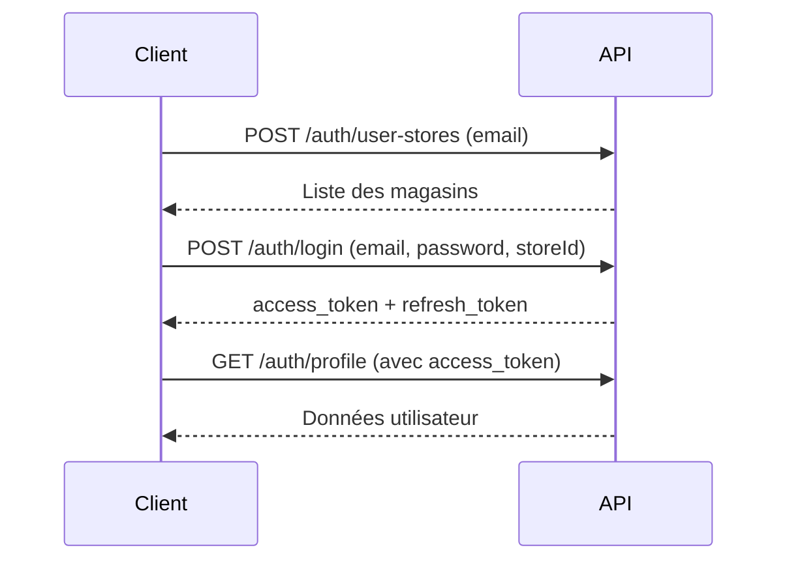
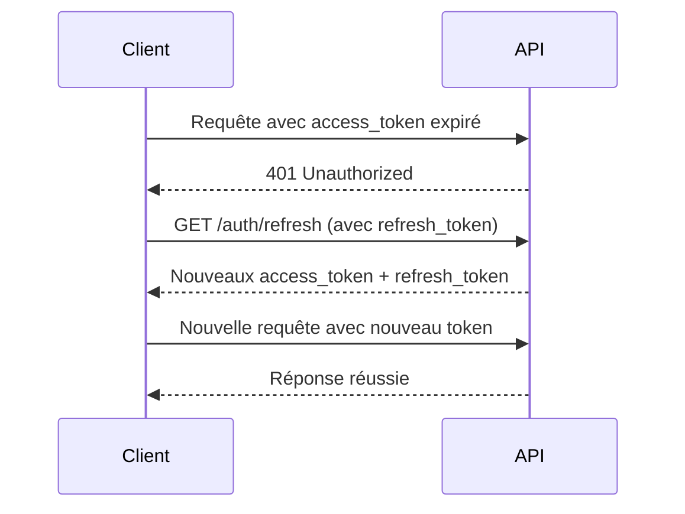
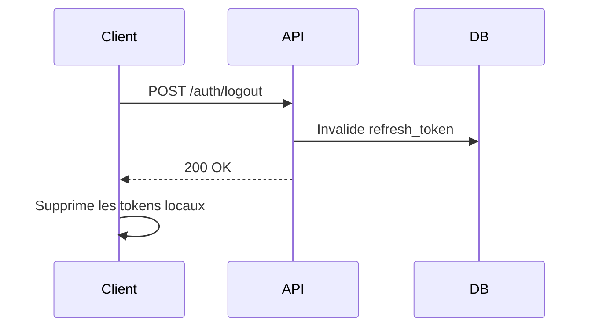

# Authentication API

## Vue d'ensemble

Le module d'authentification gère la connexion, la déconnexion, le rafraîchissement des tokens JWT et la gestion des comptes utilisateurs.

**Base URL:** `/auth`

---

## Endpoints Publics

### POST /auth/login

Authentifie un utilisateur et retourne les tokens JWT.

#### Requête

**Headers:**
```
Content-Type: application/json
```

**Body:**
```json
{
  "email": "user@example.com",
  "password": "motdepasse123",
  "storeId": 1
}
```

**Paramètres:**

| Champ | Type | Requis | Description |
|-------|------|--------|-------------|
| email | string | Oui | Adresse email de l'utilisateur |
| password | string | Oui | Mot de passe de l'utilisateur |
| storeId | number | Oui | Identifiant du magasin |

#### Réponses

**Succès (200 OK):**
```json
{
  "access_token": "eyJhbGciOiJIUzI1NiIsInR5cCI6IkpXVCJ9...",
  "refresh_token": "eyJhbGciOiJIUzI1NiIsInR5cCI6IkpXVCJ9...",
  "message": "Connexion réussie",
  "code": "LOGIN_SUCCESS"
}
```

**Erreurs possibles:**

| Code HTTP | Code d'erreur | Description |
|-----------|---------------|-------------|
| 401 | INVALID_CREDENTIALS | Email ou mot de passe incorrect |
| 403 | ACCOUNT_INACTIVE | Compte désactivé |
| 404 | USER_NOT_FOUND | Utilisateur non trouvé |
| 500 | INTERNAL_ERROR | Erreur serveur inattendue |

**Exemple d'erreur:**
```json
{
  "message": "Email ou mot de passe incorrect",
  "code": "INVALID_CREDENTIALS",
  "timestamp": "2024-12-11T10:00:00Z"
}
```

#### Exemples

**cURL:**
```bash
curl -X POST http://localhost:3000/auth/login \
  -H "Content-Type: application/json" \
  -d '{
    "email": "user@example.com",
    "password": "password123",
    "storeId": 1
  }'
```

**JavaScript:**
```javascript
const response = await fetch('http://localhost:3000/auth/login', {
  method: 'POST',
  headers: {
    'Content-Type': 'application/json',
  },
  body: JSON.stringify({
    email: 'user@example.com',
    password: 'password123',
    storeId: 1
  })
});

const data = await response.json();
console.log(data.access_token);
```

---

### POST /auth/user-stores

Récupère la liste des magasins associés à un utilisateur.

#### Requête

**Headers:**
```
Content-Type: application/json
```

**Body:**
```json
{
  "email": "user@example.com"
}
```

#### Réponses

**Succès (200 OK):**
```json
{
  "stores": [
    {
      "idStore": 1,
      "storeName": "Magasin Principal",
      "address": "123 Rue Example"
    },
    {
      "idStore": 2,
      "storeName": "Succursale Nord",
      "address": "456 Avenue Test"
    }
  ],
  "message": "Magasins récupérés avec succès",
  "code": "STORES_RETRIEVED"
}
```

**Erreurs:**
```json
{
  "message": "Utilisateur non trouvé",
  "code": "USER_NOT_FOUND",
  "stores": [],
  "timestamp": "2024-12-11T10:00:00Z"
}
```

#### Exemple

**cURL:**
```bash
curl -X POST http://localhost:3000/auth/user-stores \
  -H "Content-Type: application/json" \
  -d '{"email": "user@example.com"}'
```

---

### GET /auth/refresh

Rafraîchit le token d'accès à l'aide du refresh token.

#### Requête

**Headers:**
```
Authorization: Bearer {refresh_token}
```
ou
```
X-Refresh-Token: {refresh_token}
```

#### Réponses

**Succès (200 OK):**
```json
{
  "access_token": "eyJhbGciOiJIUzI1NiIsInR5cCI6IkpXVCJ9...",
  "refresh_token": "eyJhbGciOiJIUzI1NiIsInR5cCI6IkpXVCJ9...",
  "code": "REFRESH_SUCCESS",
  "timestamp": "2024-12-11T10:00:00Z"
}
```

**Erreur (401 Unauthorized):**
```json
{
  "message": "Refresh token invalide ou expiré",
  "code": "REFRESH_TOKEN_INVALID",
  "timestamp": "2024-12-11T10:00:00Z"
}
```

#### Exemple

**cURL:**
```bash
curl -X GET http://localhost:3000/auth/refresh \
  -H "Authorization: Bearer {votre_refresh_token}"
```

---

## Endpoints Protégés

> [!NOTE]
> Ces endpoints nécessitent un token d'accès valide dans le header Authorization.

### GET /auth/profile

Récupère le profil de l'utilisateur connecté.

#### Requête

**Headers:**
```
Authorization: Bearer {access_token}
```

#### Réponses

**Succès (200 OK):**
```json
{
  "user": {
    "idUser": 1,
    "emailAddress": "user@example.com",
    "firstName": "Jean",
    "lastName": "Dupont",
    "role": "USER",
    "isActive": true,
    "createdAt": "2024-01-15T10:00:00Z",
    "updatedAt": "2024-12-11T10:00:00Z",
    "stores": [
      {
        "idStore": 1,
        "storeName": "Magasin Principal"
      }
    ]
  },
  "message": "Profile retrieved successfully",
  "code": "PROFILE_RETRIEVED",
  "timestamp": "2024-12-11T10:00:00Z"
}
```

**Erreurs:**

| Code HTTP | Code | Description |
|-----------|------|-------------|
| 401 | ACCOUNT_INACTIVE | Compte désactivé |
| 401 | UNAUTHORIZED | Token invalide ou expiré |
| 500 | PROFILE_RETRIEVAL_FAILED | Erreur serveur |

#### Exemple

**cURL:**
```bash
curl -X GET http://localhost:3000/auth/profile \
  -H "Authorization: Bearer {votre_access_token}"
```

**JavaScript:**
```javascript
const response = await fetch('http://localhost:3000/auth/profile', {
  headers: {
    'Authorization': `Bearer ${accessToken}`
  }
});

const { user } = await response.json();
console.log(user);
```

---

### POST /auth/logout

Déconnecte l'utilisateur de la session actuelle.

#### Requête

**Headers:**
```
Authorization: Bearer {access_token}
```

#### Réponses

**Succès (200 OK):**
```json
{
  "message": "Logged out successfully",
  "code": "LOGOUT_SUCCESS",
  "timestamp": "2024-12-11T10:00:00Z"
}
```

**Erreur (500):**
```json
{
  "message": "Logout failed",
  "code": "LOGOUT_FAILED",
  "timestamp": "2024-12-11T10:00:00Z"
}
```

#### Exemple

**cURL:**
```bash
curl -X POST http://localhost:3000/auth/logout \
  -H "Authorization: Bearer {votre_access_token}"
```

---

### POST /auth/logout-all

Déconnecte l'utilisateur de toutes les sessions actives.

#### Requête

**Headers:**
```
Authorization: Bearer {access_token}
```

#### Réponses

**Succès (200 OK):**
```json
{
  "message": "Logged out from all sessions successfully",
  "code": "LOGOUT_ALL_SUCCESS",
  "timestamp": "2024-12-11T10:00:00Z"
}
```

#### Exemple

**cURL:**
```bash
curl -X POST http://localhost:3000/auth/logout-all \
  -H "Authorization: Bearer {votre_access_token}"
```

---

### POST /auth/change-password

Change le mot de passe de l'utilisateur connecté.

#### Requête

**Headers:**
```
Authorization: Bearer {access_token}
Content-Type: application/json
```

**Body:**
```json
{
  "oldPassword": "ancienMotDePasse123",
  "newPassword": "nouveauMotDePasse456"
}
```

**Validations:**
- Les deux mots de passe sont requis
- Les mots de passe ne peuvent pas être vides
- Le nouveau mot de passe doit contenir au moins 6 caractères

#### Réponses

**Succès (200 OK):**
```json
{
  "message": "Password changed successfully. Please login again.",
  "code": "PASSWORD_CHANGED",
  "timestamp": "2024-12-11T10:00:00Z"
}
```

**Erreurs possibles:**

| Code HTTP | Code | Description |
|-----------|------|-------------|
| 400 | MISSING_PASSWORDS | Mots de passe manquants |
| 400 | EMPTY_PASSWORDS | Mots de passe vides |
| 400 | PASSWORD_TOO_SHORT | Nouveau mot de passe trop court |
| 400 | VALIDATION_ERROR | Erreur de validation |
| 404 | USER_NOT_FOUND | Utilisateur non trouvé |
| 500 | PASSWORD_CHANGE_FAILED | Échec du changement |

#### Exemple

**cURL:**
```bash
curl -X POST http://localhost:3000/auth/change-password \
  -H "Authorization: Bearer {votre_access_token}" \
  -H "Content-Type: application/json" \
  -d '{
    "oldPassword": "ancien123",
    "newPassword": "nouveau456"
  }'
```

---

## Endpoints Administrateurs

> [!WARNING]
> Ces endpoints nécessitent le rôle ADMIN.

### POST /auth/users/:id/deactivate

Désactive un compte utilisateur.

#### Requête

**Headers:**
```
Authorization: Bearer {access_token}
```

**Paramètres URL:**
- `id` (number): Identifiant de l'utilisateur

#### Réponses

**Succès (200 OK):**
```json
{
  "message": "User deactivated successfully",
  "code": "USER_DEACTIVATED",
  "timestamp": "2024-12-11T10:00:00Z"
}
```

**Erreurs:**

| Code HTTP | Code | Description |
|-----------|------|-------------|
| 403 | FORBIDDEN | Accès non autorisé (rôle insuffisant) |
| 404 | USER_NOT_FOUND | Utilisateur non trouvé |
| 500 | DEACTIVATION_FAILED | Échec de la désactivation |

#### Exemple

**cURL:**
```bash
curl -X POST http://localhost:3000/auth/users/5/deactivate \
  -H "Authorization: Bearer {admin_access_token}"
```

---

### POST /auth/users/:id/activate

Active un compte utilisateur.

#### Requête

**Headers:**
```
Authorization: Bearer {access_token}
```

**Paramètres URL:**
- `id` (number): Identifiant de l'utilisateur

#### Réponses

**Succès (200 OK):**
```json
{
  "message": "User activated successfully",
  "code": "USER_ACTIVATED",
  "timestamp": "2024-12-11T10:00:00Z"
}
```

**Erreurs:**

| Code HTTP | Code | Description |
|-----------|------|-------------|
| 403 | FORBIDDEN | Accès non autorisé |
| 404 | USER_NOT_FOUND | Utilisateur non trouvé |
| 500 | ACTIVATION_FAILED | Échec de l'activation |

---

## Endpoint de Debug

### GET /auth/debug/token-info

Récupère les informations de debug du token actuel.

> [!NOTE]
> Utilisez cet endpoint uniquement en développement pour déboguer les problèmes d'authentification.

#### Requête

**Headers:**
```
Authorization: Bearer {access_token}
```

#### Réponses

**Succès (200 OK):**
```json
{
  "user": {
    "id": 1,
    "email": "user@example.com",
    "isActive": true,
    "hasRefreshToken": true,
    "refreshTokenExpiresAt": "2024-12-18T10:00:00Z",
    "stores": [
      {
        "id": 1,
        "name": "Magasin Principal"
      }
    ]
  },
  "message": "Token debug info retrieved",
  "code": "DEBUG_INFO",
  "timestamp": "2024-12-11T10:00:00Z"
}
```

---

## Flux d'authentification

### 1. Connexion initiale



### 2. Rafraîchissement du token



### 3. Déconnexion



---

## Gestion des erreurs

Toutes les réponses d'erreur suivent ce format :

```json
{
  "message": "Description de l'erreur",
  "code": "ERROR_CODE",
  "timestamp": "2024-12-11T10:00:00Z"
}
```

### Codes d'erreur communs

| Code | Description | Action recommandée |
|------|-------------|--------------------|
| LOGIN_SUCCESS | Connexion réussie | Stocker les tokens |
| INVALID_CREDENTIALS | Identifiants incorrects | Vérifier email/mot de passe |
| ACCOUNT_INACTIVE | Compte désactivé | Contacter l'administrateur |
| REFRESH_TOKEN_INVALID | Token expiré | Se reconnecter |
| PASSWORD_TOO_SHORT | Mot de passe trop court | Minimum 6 caractères |
| USER_NOT_FOUND | Utilisateur introuvable | Vérifier l'ID |
| FORBIDDEN | Accès interdit | Vérifier les permissions |

---

## Bonnes pratiques

### Stockage des tokens

```javascript
// ✅ Bon : Stocker dans httpOnly cookies (côté serveur)
// ou localStorage avec précautions

localStorage.setItem('access_token', accessToken);
localStorage.setItem('refresh_token', refreshToken);

// ❌ Mauvais : Ne jamais exposer les tokens dans l'URL
// window.location = '/dashboard?token=' + token;
```

### Gestion du refresh automatique

```javascript
async function fetchWithAuth(url, options = {}) {
  let accessToken = localStorage.getItem('access_token');
  
  let response = await fetch(url, {
    ...options,
    headers: {
      ...options.headers,
      'Authorization': `Bearer ${accessToken}`
    }
  });
  
  // Si le token est expiré, le rafraîchir
  if (response.status === 401) {
    const refreshToken = localStorage.getItem('refresh_token');
    
    const refreshResponse = await fetch('/auth/refresh', {
      headers: {
        'Authorization': `Bearer ${refreshToken}`
      }
    });
    
    if (refreshResponse.ok) {
      const { access_token, refresh_token } = await refreshResponse.json();
      localStorage.setItem('access_token', access_token);
      localStorage.setItem('refresh_token', refresh_token);
      
      // Réessayer la requête originale
      return fetch(url, {
        ...options,
        headers: {
          ...options.headers,
          'Authorization': `Bearer ${access_token}`
        }
      });
    }
  }
  
  return response;
}
```

### Sécurité

- ✅ Toujours utiliser HTTPS en production
- ✅ Définir des durées d'expiration courtes pour les access tokens (15 min)
- ✅ Définir des durées d'expiration plus longues pour les refresh tokens (7 jours)
- ✅ Valider et nettoyer toutes les entrées (trim sur l'email)
- ✅ Implémenter un rate limiting sur les endpoints sensibles
- ❌ Ne jamais logger les mots de passe ou tokens
- ❌ Ne jamais stocker les mots de passe en clair