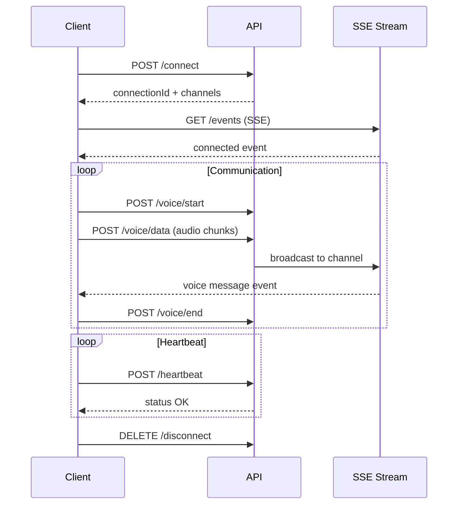

# Talkie-Walkie API

## Vue d'ensemble

Le module Talkie-Walkie permet une communication vocale en temps réel entre utilisateurs d'un même magasin via des canaux. Il utilise Server-Sent Events (SSE) pour les notifications en temps réel.

**Base URL:** `/talkie-walkie`

**Authentification:** Requise (JWT)

---

## Concepts clés

### Connexions
Chaque utilisateur doit établir une connexion avant d'utiliser le talkie-walkie. Une connexion génère un `connectionId` unique.

### Canaux (Channels)
Les utilisateurs communiquent via des canaux. Un canal peut être :
- **Public** : Accessible à tous les utilisateurs du magasin
- **Privé** : Limité à certains utilisateurs

### Heartbeat
Un système de heartbeat maintient la connexion active. Les connexions inactives expirent automatiquement.

### Server-Sent Events (SSE)
Les événements temps réel (nouveaux messages, utilisateurs connectés) sont transmis via SSE.

---

## Flux de communication



---

## Endpoints

### POST /talkie-walkie/connect

Établit une connexion talkie-walkie pour l'utilisateur.

#### Requête

**Headers:**
```
Authorization: Bearer {access_token}
Content-Type: application/json
```

**Body:**
```json
{
  "selectedStoreId": 1  // Optionnel, utilise le storeId du JWT par défaut
}
```

#### Réponses

**Succès (200 OK):**
```json
{
  "success": true,
  "data": {
    "connectionId": "conn_abc123xyz",
    "availableChannels": [
      {
        "id": "general",
        "name": "Général",
        "type": "public",
        "userCount": 5
      },
      {
        "id": "managers",
        "name": "Managers",
        "type": "private",
        "userCount": 2
      }
    ],
    "connectedUsers": [
      {
        "userId": 5,
        "userName": "Jean Dupont",
        "role": "MANAGER",
        "activeChannels": ["general"]
      }
    ],
    "connectionTime": "2024-12-11T10:00:00Z",
    "selectedStore": {
      "id": 1,
      "name": "Magasin Centre"
    }
  }
}
```

**Erreurs:**

| Code HTTP | Description |
|-----------|-------------|
| 400 | Store ID manquant |
| 403 | Accès au magasin non autorisé |
| 404 | Magasin non trouvé |

#### Exemple

```bash
curl -X POST http://localhost:3000/talkie-walkie/connect \
  -H "Authorization: Bearer {token}" \
  -H "Content-Type: application/json" \
  -d '{"selectedStoreId": 1}'
```

---

### DELETE /talkie-walkie/disconnect

Déconnecte l'utilisateur du talkie-walkie.

#### Requête

**Headers:**
```
Authorization: Bearer {access_token}
```

#### Réponses

**Succès (200 OK):**
```json
{
  "success": true
}
```

#### Exemple

```bash
curl -X DELETE http://localhost:3000/talkie-walkie/disconnect \
  -H "Authorization: Bearer {token}"
```

---

### POST /talkie-walkie/heartbeat

Maintient la connexion active et vérifie son statut.

#### Requête

**Headers:**
```
Authorization: Bearer {access_token}
Content-Type: application/json
```

**Body:**
```json
{
  "connectionId": "conn_abc123xyz"  // Optionnel
}
```

#### Réponses

**Succès (200 OK):**
```json
{
  "success": true,
  "status": {
    "isConnected": true,
    "lastHeartbeat": "2024-12-11T10:05:00Z",
    "activeChannels": ["general"],
    "shouldReconnect": false
  }
}
```

**Connexion expirée:**
```json
{
  "success": false,
  "status": {
    "isConnected": false,
    "shouldReconnect": true
  },
  "message": "Connection expired, please reconnect"
}
```

#### Exemple

```bash
curl -X POST http://localhost:3000/talkie-walkie/heartbeat \
  -H "Authorization: Bearer {token}" \
  -H "Content-Type: application/json" \
  -d '{"connectionId": "conn_abc123xyz"}'
```

---

### GET /talkie-walkie/connection/status

Vérifie le statut d'une connexion.

#### Requête

**Headers:**
```
Authorization: Bearer {access_token}
```

**Query Parameters:**
- `connectionId` (required): ID de la connexion

#### Réponses

**Succès (200 OK):**
```json
{
  "success": true,
  "data": {
    "isValid": true,
    "isConnected": true,
    "currentConnectionId": "conn_abc123xyz",
    "expiresAt": "2024-12-11T11:00:00Z"
  }
}
```

#### Exemple

```bash
curl -X GET "http://localhost:3000/talkie-walkie/connection/status?connectionId=conn_abc123xyz" \
  -H "Authorization: Bearer {token}"
```

---

### GET /talkie-walkie/users

Récupère la liste des utilisateurs connectés.

#### Requête

**Headers:**
```
Authorization: Bearer {access_token}
```

**Query Parameters:**
- `channel` (optional): Filtrer par canal

#### Réponses

**Succès (200 OK):**
```json
{
  "success": true,
  "data": [
    {
      "userId": 5,
      "userName": "Jean Dupont",
      "email": "jean.dupont@example.com",
      "role": "MANAGER",
      "storeId": 1,
      "storeName": "Magasin Centre",
      "connectionId": "conn_abc123xyz",
      "activeChannels": ["general", "managers"],
      "connectedAt": "2024-12-11T10:00:00Z",
      "lastActivity": "2024-12-11T10:05:00Z"
    }
  ]
}
```

#### Exemple

```bash
# Tous les utilisateurs
curl -X GET http://localhost:3000/talkie-walkie/users \
  -H "Authorization: Bearer {token}"

# Utilisateurs d'un canal spécifique
curl -X GET "http://localhost:3000/talkie-walkie/users?channel=general" \
  -H "Authorization: Bearer {token}"
```

---

### GET /talkie-walkie/channels

Récupère les canaux disponibles.

#### Requête

**Headers:**
```
Authorization: Bearer {access_token}
```

#### Réponses

**Succès (200 OK):**
```json
{
  "success": true,
  "data": [
    {
      "id": "general",
      "name": "Général",
      "description": "Canal public pour tous",
      "type": "public",
      "userCount": 5,
      "isActive": true
    },
    {
      "id": "managers",
      "name": "Managers",
      "description": "Canal réservé aux managers",
      "type": "private",
      "userCount": 2,
      "isActive": true
    }
  ]
}
```

#### Exemple

```bash
curl -X GET http://localhost:3000/talkie-walkie/channels \
  -H "Authorization: Bearer {token}"
```

---

### POST /talkie-walkie/channels/:channelId/join

Rejoint un canal.

#### Requête

**Headers:**
```
Authorization: Bearer {access_token}
```

**Paramètres URL:**
- `channelId`: ID du canal à rejoindre

#### Réponses

**Succès (200 OK):**
```json
{
  "success": true
}
```

**Erreurs:**
- 404: Canal non trouvé
- 403: Accès au canal non autorisé

#### Exemple

```bash
curl -X POST http://localhost:3000/talkie-walkie/channels/general/join \
  -H "Authorization: Bearer {token}"
```

---

### DELETE /talkie-walkie/channels/:channelId/leave

Quitte un canal.

#### Requête

**Headers:**
```
Authorization: Bearer {access_token}
```

**Paramètres URL:**
- `channelId`: ID du canal à quitter

#### Réponses

**Succès (200 OK):**
```json
{
  "success": true
}
```

#### Exemple

```bash
curl -X DELETE http://localhost:3000/talkie-walkie/channels/general/leave \
  -H "Authorization: Bearer {token}"
```

---

### POST /talkie-walkie/voice/start

Démarre l'envoi d'un message vocal.

#### Requête

**Headers:**
```
Authorization: Bearer {access_token}
Content-Type: application/json
```

**Body:**
```json
{
  "channel": "general"
}
```

#### Réponses

**Succès (200 OK):**
```json
{
  "success": true,
  "data": {
    "messageId": "msg_xyz789",
    "startTime": "2024-12-11T10:05:00Z"
  }
}
```

#### Exemple

```bash
curl -X POST http://localhost:3000/talkie-walkie/voice/start \
  -H "Authorization: Bearer {token}" \
  -H "Content-Type: application/json" \
  -d '{"channel": "general"}'
```

---

### POST /talkie-walkie/voice/data

Envoie les données audio (chunks).

#### Requête

**Headers:**
```
Authorization: Bearer {access_token}
Content-Type: application/json
```

**Body:**
```json
{
  "channel": "general",
  "audioData": "base64_encoded_audio_chunk",
  "sequenceNumber": 1,
  "messageId": "msg_xyz789"
}
```

#### Réponses

**Succès (200 OK):**
```json
{
  "success": true
}
```

#### Exemple

```javascript
// Exemple d'envoi de chunks audio
async function sendVoiceData(audioBlob, channel) {
  const reader = new FileReader();
  reader.readAsDataURL(audioBlob);
  
  reader.onloadend = async () => {
    const base64Data = reader.result.split(',')[1];
    
    await fetch('/talkie-walkie/voice/data', {
      method: 'POST',
      headers: {
        'Authorization': `Bearer ${token}`,
        'Content-Type': 'application/json'
      },
      body: JSON.stringify({
        channel,
        audioData: base64Data,
        sequenceNumber: 1,
        messageId: 'msg_xyz789'
      })
    });
  };
}
```

---

### POST /talkie-walkie/voice/end

Termine l'envoi d'un message vocal.

#### Requête

**Headers:**
```
Authorization: Bearer {access_token}
Content-Type: application/json
```

**Body:**
```json
{
  "channel": "general"
}
```

#### Réponses

**Succès (200 OK):**
```json
{
  "success": true
}
```

---

### POST /talkie-walkie/emergency

Envoie un message d'urgence (broadcast).

#### Requête

**Headers:**
```
Authorization: Bearer {access_token}
Content-Type: application/json
```

**Body:**
```json
{
  "message": "Urgence au rayon électronique",
  "location": "Rayon 5",
  "priority": "HIGH"
}
```

#### Réponses

**Succès (200 OK):**
```json
{
  "success": true
}
```

---

### GET /talkie-walkie/messages/pending

Récupère les messages en attente (polling fallback).

#### Requête

**Headers:**
```
Authorization: Bearer {access_token}
```

**Query Parameters:**
- `since` (optional): ISO timestamp
- `channel` (optional): Filtrer par canal
- `connectionId` (optional): ID de connexion

#### Réponses

**Succès (200 OK):**
```json
{
  "success": true,
  "data": {
    "messages": [
      {
        "id": "msg_xyz789",
        "type": "voice",
        "channel": "general",
        "sender": {
          "userId": 5,
          "userName": "Jean Dupont"
        },
        "timestamp": "2024-12-11T10:05:00Z",
        "audioData": "base64_encoded_audio"
      }
    ],
    "newConnectionId": "conn_abc123xyz"
  }
}
```

**Reconnexion nécessaire:**
```json
{
  "success": false,
  "shouldReconnect": true,
  "message": "Invalid connection, please reconnect",
  "data": {
    "newConnectionId": null
  }
}
```

---

### GET /talkie-walkie/users/sync

Synchronise la liste des utilisateurs connectés.

#### Requête

**Headers:**
```
Authorization: Bearer {access_token}
```

#### Réponses

**Succès (200 OK):**
```json
{
  "success": true,
  "data": {
    "users": [
      {
        "userId": 5,
        "userName": "Jean Dupont",
        "role": "MANAGER",
        "activeChannels": ["general"]
      }
    ],
    "timestamp": "2024-12-11T10:05:00Z"
  }
}
```

---

### GET /talkie-walkie/events

**Server-Sent Events (SSE)** - Stream d'événements temps réel.

#### Requête

**Headers:**
```
Authorization: Bearer {access_token}
```

**Query Parameters:**
- `connectionId` (optional): ID de connexion

#### Format des événements

**Événement de connexion:**
```
data: {"type":"connected","timestamp":"2024-12-11T10:00:00Z","connectionId":"conn_abc123xyz","activeUsers":5,"connectedUsers":[...]}
```

**Heartbeat:**
```
data: {"type":"heartbeat","timestamp":"2024-12-11T10:00:15Z","activeUsers":5}
```

**Message vocal:**
```
data: {"type":"voice_message","channel":"general","sender":{"userId":5,"userName":"Jean Dupont"},"audioData":"base64...","timestamp":"2024-12-11T10:05:00Z"}
```

**Utilisateur connecté:**
```
data: {"type":"user_joined","user":{"userId":7,"userName":"Marie Martin"},"channel":"general","timestamp":"2024-12-11T10:06:00Z"}
```

**Utilisateur déconnecté:**
```
data: {"type":"user_left","userId":7,"channel":"general","timestamp":"2024-12-11T10:10:00Z"}
```

**Urgence:**
```
data: {"type":"emergency","message":"Urgence au rayon 5","sender":{"userId":5,"userName":"Jean Dupont"},"location":"Rayon 5","priority":"HIGH","timestamp":"2024-12-11T10:07:00Z"}
```

#### Exemple d'utilisation (JavaScript)

```javascript
const eventSource = new EventSource(
  `/talkie-walkie/events?connectionId=${connectionId}`,
  {
    headers: {
      'Authorization': `Bearer ${token}`
    }
  }
);

eventSource.onmessage = (event) => {
  const data = JSON.parse(event.data);
  
  switch (data.type) {
    case 'connected':
      console.log('Connected:', data.connectionId);
      updateUserList(data.connectedUsers);
      break;
      
    case 'voice_message':
      playAudioMessage(data.audioData);
      break;
      
    case 'user_joined':
      addUserToList(data.user);
      break;
      
    case 'user_left':
      removeUserFromList(data.userId);
      break;
      
    case 'emergency':
      showEmergencyAlert(data);
      break;
      
    case 'heartbeat':
      // Connexion active
      break;
  }
};

eventSource.onerror = (error) => {
  console.error('SSE Error:', error);
  eventSource.close();
  // Reconnexion
};
```

---

### GET /talkie-walkie/channels/:channelId/status

Récupère le statut d'un canal.

#### Réponses

**Succès (200 OK):**
```json
{
  "success": true,
  "data": {
    "channelId": "general",
    "isActive": true,
    "userCount": 5,
    "activeUsers": [
      {
        "userId": 5,
        "userName": "Jean Dupont"
      }
    ],
    "lastActivity": "2024-12-11T10:05:00Z"
  }
}
```

---

### GET /talkie-walkie/stats

Récupère les statistiques de connexion.

#### Réponses

**Succès (200 OK):**
```json
{
  "success": true,
  "data": {
    "totalConnections": 12,
    "activeConnections": 5,
    "totalChannels": 3,
    "activeChannels": 2,
    "messagesLast24h": 156,
    "averageConnectionDuration": "45m",
    "peakConcurrentUsers": 8
  }
}
```

---

## Exemple d'implémentation complète

```javascript
class TalkieWalkieClient {
  constructor(token) {
    this.token = token;
    this.connectionId = null;
    this.eventSource = null;
    this.heartbeatInterval = null;
  }

  async connect(storeId) {
    const response = await fetch('/talkie-walkie/connect', {
      method: 'POST',
      headers: {
        'Authorization': `Bearer ${this.token}`,
        'Content-Type': 'application/json'
      },
      body: JSON.stringify({ selectedStoreId: storeId })
    });

    const data = await response.json();
    this.connectionId = data.data.connectionId;

    // Démarrer le stream SSE
    this.startEventStream();

    // Démarrer le heartbeat
    this.startHeartbeat();

    return data;
  }

  startEventStream() {
    this.eventSource = new EventSource(
      `/talkie-walkie/events?connectionId=${this.connectionId}`
    );

    this.eventSource.onmessage = (event) => {
      const data = JSON.parse(event.data);
      this.handleEvent(data);
    };

    this.eventSource.onerror = () => {
      console.error('SSE connection lost');
      this.reconnect();
    };
  }

  startHeartbeat() {
    this.heartbeatInterval = setInterval(async () => {
      try {
        const response = await fetch('/talkie-walkie/heartbeat', {
          method: 'POST',
          headers: {
            'Authorization': `Bearer ${this.token}`,
            'Content-Type': 'application/json'
          },
          body: JSON.stringify({ connectionId: this.connectionId })
        });

        const data = await response.json();
        
        if (data.status?.shouldReconnect) {
          this.reconnect();
        }
      } catch (error) {
        console.error('Heartbeat failed:', error);
      }
    }, 15000); // Toutes les 15 secondes
  }

  async sendVoiceMessage(channel, audioBlob) {
    // 1. Start
    await fetch('/talkie-walkie/voice/start', {
      method: 'POST',
      headers: {
        'Authorization': `Bearer ${this.token}`,
        'Content-Type': 'application/json'
      },
      body: JSON.stringify({ channel })
    });

    // 2. Send audio data
    const reader = new FileReader();
    reader.readAsDataURL(audioBlob);
    
    reader.onloadend = async () => {
      const audioData = reader.result.split(',')[1];
      
      await fetch('/talkie-walkie/voice/data', {
        method: 'POST',
        headers: {
          'Authorization': `Bearer ${this.token}`,
          'Content-Type': 'application/json'
        },
        body: JSON.stringify({
          channel,
          audioData,
          sequenceNumber: 1
        })
      });

      // 3. End
      await fetch('/talkie-walkie/voice/end', {
        method: 'POST',
        headers: {
          'Authorization': `Bearer ${this.token}`,
          'Content-Type': 'application/json'
        },
        body: JSON.stringify({ channel })
      });
    };
  }

  handleEvent(data) {
    switch (data.type) {
      case 'voice_message':
        this.playAudio(data.audioData);
        break;
      case 'user_joined':
        console.log(`${data.user.userName} joined`);
        break;
      case 'emergency':
        this.showEmergencyAlert(data);
        break;
    }
  }

  async disconnect() {
    clearInterval(this.heartbeatInterval);
    this.eventSource?.close();

    await fetch('/talkie-walkie/disconnect', {
      method: 'DELETE',
      headers: {
        'Authorization': `Bearer ${this.token}`
      }
    });
  }

  async reconnect() {
    await this.disconnect();
    // Attendre un peu avant de reconnecter
    setTimeout(() => this.connect(), 1000);
  }
}

// Utilisation
const client = new TalkieWalkieClient(token);
await client.connect(1);
await client.sendVoiceMessage('general', audioBlob);
```

---

## Bonnes pratiques

### Gestion de la connexion

✅ **Toujours vérifier le statut** avant d'envoyer des messages
✅ **Implémenter le heartbeat** pour maintenir la connexion
✅ **Gérer la reconnexion automatique** en cas de déconnexion
✅ **Fermer proprement** la connexion lors de la déconnexion

### Performance

✅ **Compresser l'audio** avant l'envoi
✅ **Envoyer des chunks** plutôt que le fichier complet
✅ **Utiliser SSE** plutôt que du polling

### Sécurité

✅ **Valider les permissions** de canal
✅ **Limiter la taille** des messages audio
✅ **Nettoyer les connexions** expirées

### UX

✅ **Afficher un indicateur** de connexion
✅ **Notifier l'utilisateur** des nouveaux messages
✅ **Gérer les erreurs** avec des messages clairs