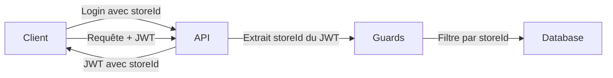

# Système Multi-Magasins

## Principe de fonctionnement

L'API utilise un système de **filtrage automatique par magasin** pour isoler les données.

### Comment ça marche ?

1. **Lors du login**, l'utilisateur choisit un magasin
2. Le **storeId** est inclus dans le JWT token
3. **Toutes les requêtes** utilisent automatiquement ce storeId pour filtrer les données

## Architecture


## Exemple de flux

### 1. Login avec sélection du magasin
```bash
POST /auth/login
{
  "email": "manager@example.com",
  "password": "password",
  "storeId": 1
}
```

**Réponse :**
```json
{
  "access_token": "eyJhbGciOiJIUzI1NiIsInR5cCI6IkpXVCJ9...",
  "refresh_token": "...",
  "message": "Connexion réussie"
}
```

Le JWT contient :
```json
{
  "idUser": 5,
  "email": "manager@example.com",
  "storeId": 1,  // ← Store sélectionné
  "role": "MANAGER"
}
```

### 2. Requêtes automatiquement filtrées
```bash
GET /products
Authorization: Bearer {token}
```

**Comportement interne :**
```typescript
// Le Guard extrait automatiquement le storeId du JWT
const storeId = req.user.storeId; // = 1

// La requête est filtrée
SELECT * FROM products WHERE storeId = 1;
```

**Résultat :** Uniquement les produits du magasin 1

## Guards de protection

### JwtAuthGuard

Vérifie que l'utilisateur est authentifié.

### StoreAuthGuard

Extrait et vérifie le storeId du token JWT.
```typescript
@UseGuards(JwtAuthGuard, StoreAuthGuard)
```

## Cas d'usage

### Utilisateur avec un seul magasin
```javascript
// Login automatique avec son unique magasin
POST /auth/login
{
  "email": "employee@example.com",
  "password": "pass",
  "storeId": 2  // Son unique magasin
}

// Toutes ses requêtes seront limitées au magasin 2
```

### Manager avec plusieurs magasins
```javascript
// 1. Récupérer ses magasins
POST /auth/user-stores
{
  "email": "manager@example.com"
}

// Réponse
{
  "stores": [
    { "idStore": 1, "storeName": "Magasin Centre" },
    { "idStore": 3, "storeName": "Magasin Nord" }
  ]
}

// 2. Login avec le magasin choisi
POST /auth/login
{
  "email": "manager@example.com",
  "password": "pass",
  "storeId": 1  // Choisit le magasin Centre
}

// 3. Pour changer de magasin : se reconnecter avec l'autre storeId
```

### Admin (accès tous magasins)

Pour un admin qui a besoin d'accéder à tous les magasins :
```javascript
// Option 1 : Se connecter sans storeId spécifique
// (nécessite une modification du backend)

// Option 2 : Se connecter avec un storeId par défaut
// puis le backend ignore le filtre pour les ADMIN
```

## Avantages

✅ **Sécurité** : Isolation automatique des données
✅ **Simplicité** : Pas besoin de passer storeId à chaque requête
✅ **Performance** : Filtrage au niveau de la base de données
✅ **Maintenabilité** : Logique centralisée dans les guards

## Points d'attention

⚠️ **Changement de magasin** : Nécessite une reconnexion
⚠️ **Token expiré** : Le storeId est perdu, nouvelle connexion requise
⚠️ **Admin** : Besoin d'une logique spéciale pour accès multi-magasins

## Endpoints affectés

Tous les endpoints protégés par `StoreAuthGuard` :
- `/products/*`
- `/orders/*`
- `/inventory/*`
- `/export/*`
- `/writeoffs/*`
- `/display/*`