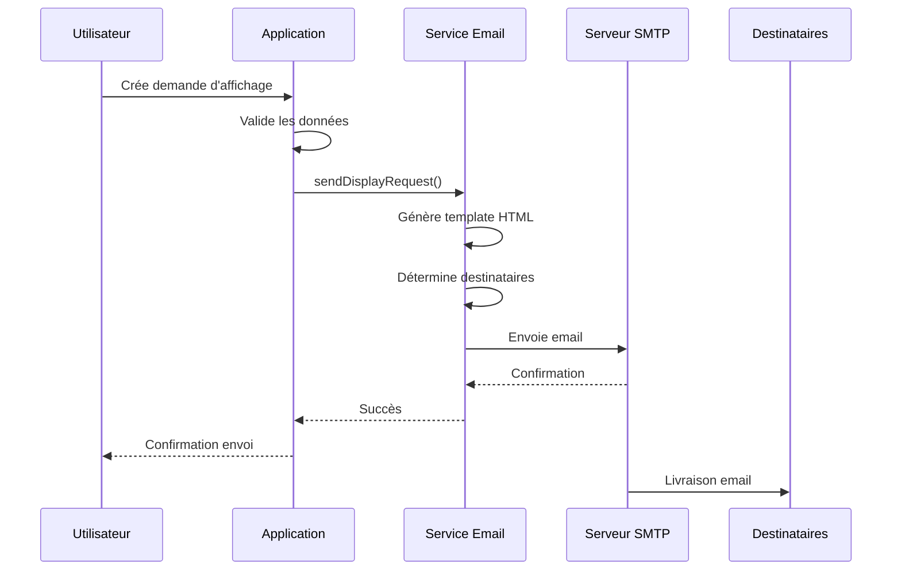

# Service de Demandes d'Affichage

## Vue d'ensemble

Le service de demandes d'affichage permet aux équipes de magasin de commander des affiches produits auprès du service marketing ou impression. Les demandes sont envoyées automatiquement par email avec tous les détails nécessaires.

---

## Fonctionnalités Principales

### Création de Demande

**Informations requises :**
- Nom du produit
- Code produit
- Code-barres
- Prix à afficher
- Quantité d'affiches souhaitée
- Format/Dimension
- Date souhaitée
- Email destinataire (optionnel)

### Envoi Automatique par Email

**Template professionnel :**
- Design HTML responsive
- Informations structurées
- Code-barres inclus
- Priorité visuelle si urgente
- Branding de l'entreprise

---

## Structure d'une Demande

### Format de Données

```typescript
interface DisplayRequestDto {
  productName: string;           // "Café Arabica Bio 1kg"
  productCode: string;           // "PROD001"
  barcode: string;               // "3760123456789"
  price: number;                 // 12.99
  quantity: number;              // 5 (affiches)
  format: string;                // "A4" ou "A3" ou custom
  desiredDate: string;           // "2024-12-15"
  recipientEmail?: string;       // Destinataire supplémentaire
}
```

### Informations du Demandeur

**Ajoutées automatiquement :**
```typescript
{
  userName: string;              // Nom de l'utilisateur connecté
  email: string;                 // Email de l'utilisateur
  storeName: string;             // Nom du magasin
  requestDate: Date;             // Date/heure de la demande
}
```

---

## Template d'Email

### Design Professionnel

**Structure du template :**

```html
<!DOCTYPE html>
<html>
<head>
  <meta charset="UTF-8">
  <title>Demande d'affichage - [Nom Produit]</title>
</head>
<body>
  <!-- Header bleu avec logo -->
  <div style="background: #1e40af; color: white; padding: 20px;">
    <h1>Demande d'affichage</h1>
  </div>
  
  <!-- Alerte urgente si délai < 24h -->
  <div style="background: #dc2626; color: white;">
    URGENT: Demande prioritaire - Traitement requis sous 24h
  </div>
  
  <!-- Informations du demandeur -->
  <section>
    <h2>Informations du demandeur</h2>
    <table>
      <tr><td>Demandeur</td><td>Jean Dupont</td></tr>
      <tr><td>Email</td><td>jean.dupont@magasin.com</td></tr>
      <tr><td>Point de vente</td><td>Magasin Paris 01</td></tr>
      <tr><td>Date de demande</td><td>mercredi 11 décembre 2024 10:30</td></tr>
      <tr><td>Date souhaitée</td><td>vendredi 13 décembre 2024</td></tr>
    </table>
  </section>
  
  <!-- Informations produit -->
  <section>
    <h2>Informations produit</h2>
    <table>
      <tr><td>Nom du produit</td><td>Café Arabica Bio 1kg</td></tr>
      <tr><td>Code produit</td><td>PROD001</td></tr>
      <tr><td>Code-barres</td><td>3760123456789</td></tr>
      <tr><td>Prix à afficher</td><td><strong>12.99 €</strong></td></tr>
    </table>
  </section>
  
  <!-- Spécifications d'impression -->
  <section>
    <h2>Spécifications d'impression</h2>
    <table>
      <tr><td>Quantité d'affiches</td><td>5 unités</td></tr>
      <tr><td>Format / Dimension</td><td>A4</td></tr>
    </table>
  </section>
  
  <!-- Contact -->
  <section>
    <p>Pour toute question, contactez <strong>Jean Dupont</strong> à 
       <a href="mailto:jean.dupont@magasin.com">jean.dupont@magasin.com</a>
    </p>
  </section>
  
  <!-- Footer -->
  <footer style="font-size: 12px; color: #777;">
    Cet email a été généré automatiquement.<br/>
    Merci de ne pas répondre directement à cette adresse.
  </footer>
</body>
</html>
```

### Mise en Forme Responsive

**Optimisé pour :**
- Mobile (smartphones)
- Desktop (clients email)
- Web (Gmail, Outlook Web)

**Éléments visuels :**
- Header bleu corporate
- Tableaux structurés
- Prix en gras et souligné
- Alerte rouge si urgent
- Footer informatif

---

## Configuration SMTP

### Paramètres Requis

```typescript
{
  SMTP_HOST: 'smtp.gmail.com',        // ou autre serveur SMTP
  SMTP_PORT: 587,                      // 587 (TLS) ou 465 (SSL)
  SMTP_USER: 'noreply@entreprise.com', // Email émetteur
  SMTP_PASS: 'mot_de_passe_app',      // Mot de passe
  SMTP_FROM: 'Sodifram - Logitrack',  // Nom affiché
  DISPLAY_RECIPIENTS: 'print@entreprise.com,marketing@entreprise.com'
}
```

### Configuration par Environnement

**Fichier `.env` :**
```env
# SMTP Configuration
SMTP_HOST=smtp.gmail.com
SMTP_PORT=587
SMTP_USER=noreply@votre-entreprise.com
SMTP_PASS=votre_mot_de_passe_app
SMTP_FROM=noreply@votre-entreprise.com

# Destinataires par défaut (séparés par virgules)
DISPLAY_RECIPIENTS=impression@entreprise.com,marketing@entreprise.com
```

### Vérification au Démarrage

```typescript
// Au démarrage de l'application
this.transporter.verify((error, success) => {
  if (error) {
    console.warn('ATTENTION: SMTP not configured, emails will be disabled');
  } else {
    console.log('SUCCÈS: SMTP server is ready to send emails');
  }
});
```

---

## Processus d'Envoi

### Flux Complet



### Gestion des Destinataires

**Règle de priorité :**
1. **Destinataires par défaut** (config `DISPLAY_RECIPIENTS`)
2. **+ Destinataire additionnel** (si fourni dans la demande)

**Exemple :**
```typescript
// Config: impression@entreprise.com,marketing@entreprise.com
// + Demande avec: manager.local@entreprise.com
// = Email envoyé à 3 destinataires
```

**Validation :**
```typescript
if (recipients.length === 0) {
  throw new Error('Aucun destinataire configuré ou fourni');
}
```

---

## Gestion des Priorités

### Détection d'Urgence

**Critère :** Date souhaitée ≤ 24h

```typescript
const isUrgent = new Date(desiredDate) <= new Date(Date.now() + 24*60*60*1000);

if (isUrgent) {
  // Afficher bannière rouge dans l'email
  // Sujet préfixé par "URGENT:"
  // Notification prioritaire
}
```

### Affichage dans l'Email

**Si urgent :**
```html
<div class="urgent">
  URGENT: Demande prioritaire - Traitement requis sous 24h
</div>
```

**Style CSS :**
```css
.urgent {
  background: #dc2626;
  color: #fff;
  text-align: center;
  padding: 10px;
  font-size: 14px;
  font-weight: 600;
}
```

---

## Formats d'Affichage

### Formats Standards

**Prédéfinis :**
- **A4** : 210 × 297 mm (standard)
- **A3** : 297 × 420 mm (grand format)
- **A5** : 148 × 210 mm (petit format)
- **10×15 cm** : Format photo
- **Custom** : Dimensions personnalisées

### Cas d'Usage par Format

| Format | Usage | Quantité Typique |
|--------|-------|------------------|
| A4 | Affichage rayon standard | 2-5 |
| A3 | Promotion importante | 1-2 |
| A5 | Étiquette produit | 10-20 |
| 10×15 | Prix flash, promos | 5-10 |
| Custom | Besoins spécifiques | Variable |

---

## Validation des Données

### Règles de Validation

**Champs obligatoires :**
```typescript
@IsNotEmpty()
@IsString()
productName: string;

@IsNotEmpty()
@IsString()
productCode: string;

@IsNotEmpty()
@IsString()
barcode: string;

@IsNotEmpty()
@IsNumber()
@Min(0)
price: number;

@IsNotEmpty()
@IsInt()
@Min(1)
quantity: number;

@IsNotEmpty()
@IsString()
format: string;

@IsNotEmpty()
@IsDateString()
desiredDate: string;
```

**Champs optionnels :**
```typescript
@IsOptional()
@IsEmail()
recipientEmail?: string;
```

### Messages d'Erreur

```typescript
// Prix négatif
"price must not be less than 0"

// Quantité invalide
"quantity must be a positive integer"

// Email invalide
"recipientEmail must be a valid email"

// Date invalide
"desiredDate must be a valid ISO 8601 date string"
```

---

## Fonction de Test

### Email de Test

**Endpoint :**
```typescript
POST /display/test-email
{
  "to": "votre.email@exemple.com"
}
```

**Contenu du test :**
```html
<div>
  <h2>Email de test</h2>
  <p>Cet email confirme que la configuration SMTP fonctionne correctement.</p>
  <p>Envoyé le : mercredi 11 décembre 2024 10:45</p>
</div>
```

**Usage :**
- Vérifier la configuration SMTP
- Tester avant première utilisation
- Diagnostiquer problèmes d'envoi

---

## Cas d'Usage Pratiques

### Cas 1 : Nouveau Produit en Rayon

**Contexte :** Un nouveau produit vient d'arriver

**Processus :**
1. Manager scanne le code-barres
2. Remplit le formulaire :
   - Nom: "Café Arabica Bio 1kg"
   - Code: "PROD001"
   - Prix: 12.99 €
   - Quantité: 3 affiches
   - Format: A4
   - Date souhaitée: Dans 2 jours
3. Valide et envoie
4. Service impression reçoit l'email
5. Affiches produites et livrées

**Résultat :** Produit correctement affiché sous 48h

### Cas 2 : Promotion Flash

**Contexte :** Promo surprise demain matin

**Processus :**
1. Manager créé demande urgente
2. Date souhaitée: Lendemain
3. Format: A3 (grand format)
4. Quantité: 5 affiches
5. Email envoyé avec bannière URGENT
6. Service impression priorise
7. Impression le soir même

**Résultat :** Affiches prêtes pour ouverture magasin

### Cas 3 : Changement de Prix

**Contexte :** Prix modifié suite à promo

**Processus :**
1. Employé détecte ancien prix en rayon
2. Crée demande pour nouveau prix
3. Format: A5 (petite étiquette)
4. Quantité: 10 (plusieurs rayons)
5. Email envoyé
6. Nouvelles étiquettes produites

**Résultat :** Prix cohérents en rayon

---

## Sécurité et Permissions

### Droits d'Accès

| Action | Employé | Manager | Admin |
|--------|---------|---------|-------|
| Créer demande | Oui | Oui | Oui |
| Voir ses demandes | Oui | Oui | Oui |
| Voir toutes demandes magasin | Non | Oui | Oui |
| Voir toutes demandes | Non | Non | Oui |
| Configurer SMTP | Non | Non | Oui |
| Modifier destinataires | Non | Non | Oui |

### Protection des Données

**Informations sensibles :**
- Mot de passe SMTP chiffré en base
- Emails destinataires validés
- Logs d'envoi sécurisés

**Traçabilité :**
- Qui a fait la demande
- Quand la demande a été faite
- Email effectivement envoyé
- Succès/échec d'envoi

---

## Suivi et Reporting

### Logs d'Envoi

**Informations loggées :**
```typescript
{
  timestamp: "2024-12-11T10:45:23Z",
  userId: 123,
  userName: "Jean Dupont",
  storeId: 1,
  storeName: "Magasin Paris 01",
  recipients: ["impression@entreprise.com", "marketing@entreprise.com"],
  messageId: "abc123@smtp.gmail.com",
  status: "SUCCESS",
  productName: "Café Arabica Bio 1kg",
  quantity: 3,
  desiredDate: "2024-12-13",
  isUrgent: true
}
```

### Métriques Disponibles

**KPIs :**
- Nombre de demandes par jour/semaine/mois
- Demandes urgentes vs normales
- Temps moyen de traitement
- Taux de succès d'envoi
- Formats les plus demandés
- Produits les plus demandés

---

## Résolution de Problèmes

### Problèmes Courants

**1. "Email non reçu"**

**Causes possibles :**
- Configuration SMTP incorrecte
- Email en spam/courrier indésirable
- Destinataire incorrect

**Solutions :**
```typescript
// Tester l'envoi
POST /display/test-email { "to": "test@exemple.com" }

// Vérifier les logs serveur
this.logger.log(`Email sent successfully. Message ID: ${result.messageId}`);

// Vérifier dossier spam destinataire
```

**2. "Erreur 'SMTP not configured'"**

**Cause :** Variables d'environnement manquantes

**Solution :**
```env
# Ajouter dans .env
SMTP_HOST=smtp.gmail.com
SMTP_PORT=587
SMTP_USER=votre.email@gmail.com
SMTP_PASS=votre_mot_de_passe_app
```

**3. "Erreur 'Aucun destinataire configuré'"**

**Cause :** `DISPLAY_RECIPIENTS` non défini

**Solution :**
```env
DISPLAY_RECIPIENTS=impression@entreprise.com,marketing@entreprise.com
```

**4. "Authentification SMTP échouée"**

**Pour Gmail :**
```
Solution: Créer un "mot de passe d'application"
1. Aller dans compte Google
2. Sécurité > Validation en 2 étapes
3. Mots de passe des applications
4. Générer nouveau mot de passe
5. Utiliser ce mot de passe dans SMTP_PASS
```

---

## Configuration Avancée

### Serveurs SMTP Supportés

**Gmail :**
```env
SMTP_HOST=smtp.gmail.com
SMTP_PORT=587
SMTP_USER=votre.email@gmail.com
SMTP_PASS=mot_de_passe_app
```

**Office 365 / Outlook :**
```env
SMTP_HOST=smtp.office365.com
SMTP_PORT=587
SMTP_USER=votre.email@entreprise.com
SMTP_PASS=votre_mot_de_passe
```

**Serveur dédié :**
```env
SMTP_HOST=mail.votre-serveur.com
SMTP_PORT=587
SMTP_USER=noreply@entreprise.com
SMTP_PASS=mot_de_passe_secure
```

### Options SSL/TLS

```typescript
// Configuration actuelle (TLS)
{
  secure: false,    // false pour STARTTLS
  port: 587
}

// Pour SSL
{
  secure: true,     // true pour SSL
  port: 465
}
```

---

## Bonnes Pratiques

### À Faire

1. **Anticiper les demandes** : Commander 48h à l'avance
2. **Vérifier les infos** : Prix et code-barres corrects
3. **Format adapté** : Choisir selon l'emplacement
4. **Quantité juste** : Éviter le gaspillage
5. **Tester avant** : Utiliser l'email de test

### À Éviter

1. **Demandes last-minute** : Sauf urgence réelle
2. **Infos incorrectes** : Vérifier avant envoi
3. **Sur-commande** : Gaspillage d'affiches
4. **Email perso comme destinataire** : Utiliser emails pros
5. **Ignorer les erreurs** : Vérifier l'envoi réussi

---

## Support

**Questions sur les demandes d'affichage ?**
- Email : support-affichage@votre-entreprise.com
- Chat : Disponible dans l'application
- Service impression : +33 X XX XX XX XX

**Documentation :**
- [Guide d'utilisation](../guides/display-guide.md)
- [Configuration SMTP](../guides/smtp-setup.md)
- [Templates personnalisés](../guides/email-templates.md)

---

## Liens Utiles

- [Configuration SMTP](../guides/smtp-setup.md)
- [Gestion des Produits](stock-management.md)
- [Impression d'Étiquettes](labels.md)
- [API Reference](../api/display-requests.md)