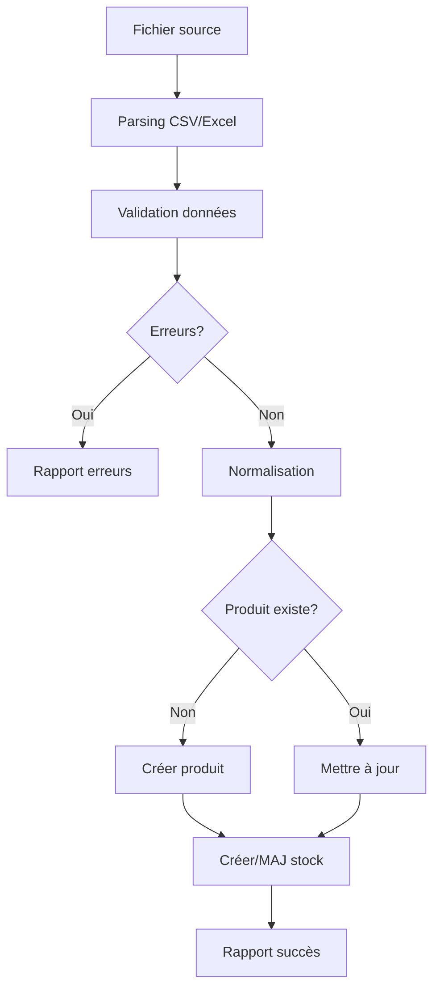

# Service d'Import/Export de Données

## Vue d'ensemble

Le service d'import/export automatise l'échange de données entre votre système et les sources externes (ERP, fournisseurs, autres systèmes). Il supporte plusieurs formats et protocoles.

---

## Capacités du Service

### Formats Supportés

**Import :**
- CSV (délimiteurs : `,` `;` `\t`)
- Excel (.xlsx, .xls)
- Encodage : UTF-8, ISO-8859-1

**Export :**
- CSV
- Excel (.xlsx)
- TXT (format spécifique)

### Protocoles

- **FTP** : Transfert classique
- **SFTP** : Transfert sécurisé (recommandé)
- **Upload manuel** : Interface web
- **API REST** : Intégration programmatique

---

## Service d'Import

### 1. Import de Produits

**Colonnes standard :**

| Colonne | Type | Obligatoire | Description |
|---------|------|-------------|-------------|
| Code Produit | string | Oui | Identifiant unique interne |
| Code-barres | string | Oui | EAN, UPC, etc. |
| Nom Produit | string | Oui | Désignation du produit |
| Quantité Magasin | number | Non | Stock en rayon |
| Quantité Entrepôt | number | Non | Stock en réserve |
| Prix Caisse | number | Non | Prix de vente |
| Prix Gestcom | number | Non | Prix gestion commerciale |
| Nom Magasin | string | Non | Point de vente |
| Nom Entrepôt | string | Non | Entrepôt de stockage |
| Nom Fournisseur | string | Non | Fournisseur principal |

**Exemple de fichier CSV :**

```csv
Code Produit,Code-barres,Nom Produit,Quantité Magasin,Prix Caisse
PROD001,3760123456789,Café Arabica 1kg,25,12.99
PROD002,3760987654321,Thé Vert Bio 50g,15,8.50
PROD003,3760555666777,Chocolat Noir 70%,30,4.99
```

**Processus d'import :**



### 2. Import de Commandes

**Colonnes standard :**

| Colonne | Type | Obligatoire | Description |
|---------|------|-------------|-------------|
| Code-barres | string | Oui | Code produit |
| Quantité | number | Oui | Quantité commandée |
| Date de commande | date | Oui | Date de la commande |

**Exemple CSV :**

```csv
Code-barres,Quantité,Date de commande
3760123456789,50,2024-12-10
3760987654321,30,2024-12-10
3760555666777,100,2024-12-11
```

**Règles métier :**
- Une commande par produit et date
- Si existe déjà : mise à jour de la quantité
- Création automatique de stock si inexistant
- Association automatique au magasin

### 3. Import Automatique (FTP/SFTP)

**Configuration :**

```typescript
{
  protocol: 'sftp',              // ou 'ftp'
  host: 'ftp.votreserveur.com',
  port: 22,                       // 22 pour SFTP, 21 pour FTP
  username: 'utilisateur',
  password: '***',
  remoteDir: '/imports',
  type: 'import',                 // ou 'export'
  storeId: 1                      // Magasin cible
}
```

**Fonctionnement :**

1. **Détection automatique** : Scan du répertoire FTP
2. **Identification du type** : Analyse des en-têtes
3. **Import produits ou commandes** : Selon le contenu
4. **Nettoyage** : Fichiers traités archivés/supprimés
5. **Rapport** : Notification par email si erreurs

**Planification :**
- Fréquence configurable (ex: toutes les 6h)
- Import nocturne recommandé
- Retry automatique en cas d'échec

---

## Service d'Export

### 1. Export d'Étiquettes

**Format de sortie :**

```csv
Code Produit,Code-barres,Nom Produit,Prix,Quantité Étiquettes
PROD001,3760123456789,Café Arabica 1kg,12.99,5
```

**Types d'export :**
- **Étiquette unique** : 1 produit, X exemplaires
- **Multi-étiquettes** : Plusieurs produits en une fois

**Cas d'usage :**
- Étiquetage de nouveaux produits
- Réimpression après perte/détérioration
- Changement de prix

### 2. Export des Casses (Write-offs)

**Format TXT personnalisé :**

```
[ENTETE]
Date: 2024-12-11
Magasin: Magasin Paris 01
Type: EXPIRED

[PRODUITS]
3760123456789|Café Arabica 1kg|5|12.99
3760987654321|Thé Vert Bio 50g|2|8.50

[TOTAL]
Articles: 2
Quantité totale: 7
Valeur totale: 81.95 €
```

**Types de casse :**
- `EXPIRED` : Produits périmés
- `DAMAGED` : Produits endommagés
- `BROKEN` : Produits cassés

**Exports disponibles :**
- Par type de casse
- Toutes les casses
- Casse unique
- Multi-casses

### 3. Export des Commandes

**Format CSV :**

```csv
Code Commande,Code-barres,Nom Produit,Quantité,Statut,Date
CMD001,3760123456789,Café Arabica 1kg,50,PENDING,2024-12-10
CMD002,3760987654321,Thé Vert Bio 50g,30,RECEIVED,2024-12-09
```

**Filtres d'export :**
- Par statut (`PENDING`, `RECEIVED`, `CANCELLED`)
- Par date
- Par magasin
- Commandes reçues uniquement

### 4. Export des Réceptions

**Format TXT :**

```
[RECEPTION]
Date: 2024-12-11 14:30:00
Utilisateur: Jean Dupont
Magasin: Magasin Paris 01

[PRODUITS]
3760123456789|Café Arabica 1kg|48|50|2|Quantité inférieure
3760987654321|Thé Vert Bio 50g|30|30|0|OK
```

**Informations incluses :**
- Quantité commandée vs reçue
- Écarts
- Commentaires
- Date et heure de réception

### 5. Export des Litiges

**Format TXT :**

```
[LITIGE]
Date: 2024-12-11
Magasin: Magasin Paris 01

[DETAILS]
Commande: CMD001
Produit: 3760123456789 - Café Arabica 1kg
Quantité commandée: 50
Quantité reçue: 45
Écart: -5
Commentaire: Cartons endommagés lors du transport
```

### 6. Export des Inventaires

**Format CSV :**

```csv
Code-barres,Nom Produit,Stock Système,Quantité Comptée,Écart,Utilisateur,Date
3760123456789,Café Arabica 1kg,25,23,-2,Jean Dupont,2024-12-11
3760987654321,Thé Vert Bio 50g,15,16,+1,Marie Martin,2024-12-11
```

---

## Processus Complets

### Import Manuel - Pas à pas

**Étape 1 : Préparation du fichier**
- Utiliser le template fourni
- Remplir les colonnes obligatoires
- Vérifier l'encodage (UTF-8)
- Sauvegarder au format CSV ou Excel

**Étape 2 : Upload**
- Connexion à l'application
- Menu "Import de données"
- Sélectionner le fichier
- Cliquer sur "Suivant"

**Étape 3 : Mapping des colonnes**
```typescript
{
  "Code Produit" => "productCode",
  "Code-barres" => "barcodeValue",
  "Nom Produit" => "productName",
  "Quantité Magasin" => "stockQuantityStore"
}
```

**Étape 4 : Validation**
- Vérification des données
- Affichage des erreurs potentielles
- Confirmation de l'import

**Étape 5 : Traitement**
- Import en cours (barre de progression)
- Rapport final :
  - X produits créés
  - Y produits mis à jour
  - Z erreurs (avec détails)

### Export FTP Automatique

**Configuration initiale :**

1. **Créer la configuration FTP**
```typescript
POST /ftp
{
  "protocol": "sftp",
  "host": "export.votreserveur.com",
  "port": 22,
  "username": "export_user",
  "password": "***",
  "remoteDir": "/exports",
  "type": "export",
  "storeId": 1
}
```

2. **Tester la connexion**
```typescript
GET /ftp/test/1
Response: {
  "success": true,
  "message": "Connexion réussie"
}
```

3. **Export déclenché automatiquement**
- Lors de la création d'une casse
- Lors de la réception d'une commande
- Lors d'un inventaire
- Selon planification (exports périodiques)

**Flux d'export FTP :**


---

## Mappings Personnalisés

### Création d'un mapping

**Interface de mapping :**
```typescript
{
  // Colonne fichier => Champ base de données
  "Référence Article": "productCode",
  "EAN": "barcodeValue",
  "Libellé": "productName",
  "Stock PDV": "stockQuantityStore",
  "Stock Entrepôt": "stockQuantityWarehouse",
  "PV TTC": "priceCaisse"
}
```

**Mappings sauvegardés :**
- Réutilisables pour imports futurs
- Par type de fichier/fournisseur
- Modifiables à tout moment

### Transformations appliquées

**Normalisation automatique :**
- **Codes-barres** : Suppression zéros, notation scientifique
- **Noms** : Trim espaces, capitalisation
- **Prix** : Conversion virgule→point, 2 décimales
- **Dates** : Format ISO 8601

**Exemple :**
```javascript
Input:  "  café arabica  " | "12,99" | "0000123456"
Output: "Café Arabica"    | 12.99   | "123456"
```

---

## Historique et Traçabilité

### Historique des Imports

**Informations conservées :**
```typescript
{
  syncDate: Date,
  syncType: 'PRODUCTS' | 'ORDERS' | 'BOTH',
  status: 'SUCCESS' | 'FAILED' | 'PARTIAL',
  filesProcessed: number,
  productsImported: number,
  productsUpdated: number,
  ordersImported: number,
  errorCount: number,
  errorDetails: string,
  durationMs: number,
  fileDetails: [{
    fileName: string,
    fileType: 'products' | 'orders',
    status: 'success' | 'failed' | 'partial',
    productsImported?: number,
    productsUpdated?: number,
    ordersImported?: number,
    errors?: string[]
  }]
}
```

**Consultation de l'historique :**
- Vue liste : 50 derniers imports
- Filtrage par statut, date, type
- Détails par import : fichiers, erreurs, durée
- Export des logs

### Nettoyage Automatique

**Politique de rétention :**
- Historique conservé : 30 jours
- Minimum conservé : 50 entrées
- Nettoyage automatique : tous les jours à 2h
- Nettoyage manuel possible par l'admin

---

## Configuration Avancée

### Import Automatique Planifié

**Configuration :**
```typescript
{
  isEnabled: true,
  frequencyHours: 6,          // Toutes les 6 heures
  nextSyncDate: Date,
  lastSyncDate: Date
}
```

**Horaires recommandés :**
- **Import produits** : 2h du matin (hors heures d'ouverture)
- **Import commandes** : Toutes les 6h (8h, 14h, 20h, 2h)
- **Export rapports** : 23h (fin de journée)

### Gestion des Erreurs

**Stratégies de retry :**
- **FTP/SFTP** : 3 tentatives avec délai exponentiel
- **Parsing** : Ligne en erreur = ignorée, autres traitées
- **Validation** : Erreur bloquante = import annulé

**Notifications :**
```typescript
{
  onSuccess: false,           // Pas de notification si OK
  onError: true,              // Email si erreur
  onPartialSuccess: true,     // Email si succès partiel
  recipients: ['manager@store.com', 'admin@company.com']
}
```

---

## Résolution de Problèmes

### Erreurs Courantes et Solutions

**1. "Erreur de parsing du fichier"**
```
Cause: Encodage incorrect ou format corrompu
Solution: Vérifier l'encodage (UTF-8), réexporter le fichier
```

**2. "Code-barres dupliqué"**
```
Cause: Même code-barres plusieurs fois dans le fichier
Solution: Nettoyer les doublons avant import
```

**3. "Connexion FTP échouée"**
```
Cause: Identifiants incorrects ou serveur inaccessible
Solution: Tester la connexion, vérifier les credentials
```

**4. "Produit avec barcode X non trouvé"**
```
Cause: Import de commandes pour produits non existants
Solution: Importer d'abord les produits, puis les commandes
```

**5. "Aucun destinataire configuré"**
```
Cause: Configuration FTP incomplète
Solution: Configurer le remoteDir et storeId
```

### Diagnostic

**Logs disponibles :**
- Logs applicatifs (NestJS)
- Historique des imports/exports
- Fichiers en erreur conservés temporairement

**Commandes utiles :**
```bash
# Voir les derniers imports
GET /import/history?limit=10

# Tester une config FTP
GET /ftp/test/:id

# Forcer un import manuel
POST /import/auto-import/run

# Voir la configuration auto-import
GET /import/auto-import/config
```

---

## Optimisation des Performances

### Bonnes Pratiques

**Taille des fichiers :**
- OK: < 10,000 lignes : Import rapide
- Attention: 10,000-50,000 : Ralentissement possible
- À éviter: > 50,000 : Diviser en plusieurs fichiers

**Format recommandé :**
- Privilégier CSV pour la performance
- Excel acceptable jusqu'à 10,000 lignes
- Compression possible (ZIP) pour transfert FTP

**Timing :**
- Planifier hors heures d'ouverture
- Éviter imports pendant utilisation intensive
- Espacer les imports (min 1h)

### Métriques

**KPIs disponibles :**
- Temps moyen d'import (ms)
- Taux de succès (%)
- Nombre de produits/heure
- Erreurs par type

---

## Intégrations

### Systèmes Compatibles

**ERPs :**
- SAP
- Sage
- Cegid
- Odoo

**Formats standards :**
- CSV ISO/UTF-8
- Excel 97-2019
- TXT délimité

**Protocoles :**
- FTP/FTPS
- SFTP (SSH)
- HTTP/HTTPS (API)

---

## Support

**Problème d'import/export ?**
- Email : support-import@votre-entreprise.com
- Chat : Disponible 24/7
- Hotline : +33 X XX XX XX XX
- Base de connaissance : [kb.votre-entreprise.com](https://kb.votre-entreprise.com)

**Templates disponibles :**
- [Template Import Produits](../templates/import-produits.csv)
- [Template Import Commandes](../templates/import-commandes.csv)
- [Mapping Example](../templates/mapping-example.json)

---

## Liens Utiles

- [Configuration FTP/SFTP](ftp-sync.md)
- [Gestion des Stocks](stock-management.md)
- [Gestion des Commandes](orders.md)
- [API Reference](../api/import-export.md)