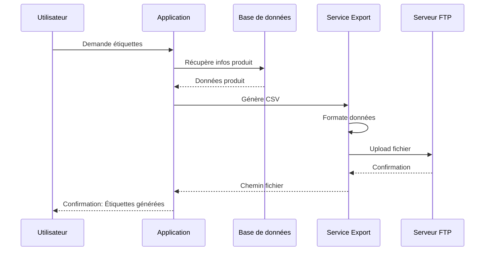

# Service d'Impression d'Étiquettes

## Vue d'ensemble

Le service d'impression d'étiquettes génère des fichiers prêts à imprimer contenant les informations produits (nom, code-barres, prix). Ces fichiers sont exportés automatiquement vers vos systèmes d'impression.

---

## Fonctionnalités Principales

### Génération d'Étiquettes

**Types d'étiquettes :**
- **Étiquette unique** : 1 produit, plusieurs exemplaires
- **Multi-étiquettes** : Plusieurs produits en une fois
- **Étiquettes de prix** : Focus sur le prix de vente
- **Étiquettes complètes** : Toutes les informations

---

## Format d'Export

### Structure CSV Standard

```csv
Code Produit,Code-barres,Nom Produit,Prix,Quantité Étiquettes
PROD001,3760123456789,Café Arabica Bio 1kg,12.99,5
PROD002,3760987654321,Thé Vert Bio 50g,8.50,3
PROD003,3760555666777,Chocolat Noir 70%,4.99,10
```

**Colonnes incluses :**
- **Code Produit** : Identifiant interne
- **Code-barres** : EAN13, UPC, etc.
- **Nom Produit** : Désignation complète
- **Prix** : Prix de vente TTC
- **Quantité Étiquettes** : Nombre d'exemplaires à imprimer

---

## Processus d'Impression

### Étape 1 : Sélection du Produit

**Méthodes de sélection :**
```typescript
// Par scan de code-barres
scanBarcode("3760123456789");

// Par recherche
searchProduct("Café Arabica");

// Par code produit
selectByCode("PROD001");
```

### Étape 2 : Configuration

**Paramètres :**
```typescript
interface LabelExportRequest {
  barcode: string;            // Code-barres du produit
  labelQuantity: number;      // Nombre d'étiquettes (1-100)
  storeId?: number;          // Magasin source
}
```

**Validation :**
- Produit doit exister en base
- Quantité minimale : 1
- Quantité maximale : 100 par lot
- Magasin doit être valide

### Étape 3 : Génération

**Processus :**


### Étape 4 : Export

**Destination :**
- Export vers FTP/SFTP configuré
- Téléchargement direct (si pas de FTP)
- Email automatique (optionnel)

**Nom du fichier :**
```
labels_YYYYMMDD_HHMMSS.csv
// Exemple: labels_20241211_143052.csv
```

---

## Types d'Export

### 1. Étiquette Unique

**Usage :** Impression d'un seul produit

**Requête :**
```typescript
POST /export/labels
{
  "barcode": "3760123456789",
  "labelQuantity": 5,
  "storeId": 1
}
```

**Résultat :**
```csv
Code Produit,Code-barres,Nom Produit,Prix,Quantité Étiquettes
PROD001,3760123456789,Café Arabica Bio 1kg,12.99,5
```

**Cas d'usage :**
- Nouveau produit en rayon
- Étiquette perdue/abîmée
- Changement de prix

### 2. Multi-Étiquettes

**Usage :** Impression de plusieurs produits

**Requête :**
```typescript
POST /export/multi-labels
{
  "labels": [
    { "barcode": "3760123456789", "labelQuantity": 5 },
    { "barcode": "3760987654321", "labelQuantity": 3 },
    { "barcode": "3760555666777", "labelQuantity": 10 }
  ],
  "storeId": 1
}
```

**Résultat :**
```csv
Code Produit,Code-barres,Nom Produit,Prix,Quantité Étiquettes
PROD001,3760123456789,Café Arabica Bio 1kg,12.99,5
PROD002,3760987654321,Thé Vert Bio 50g,8.50,3
PROD003,3760555666777,Chocolat Noir 70%,4.99,10
```

**Cas d'usage :**
- Arrivage de plusieurs produits
- Réétiquetage d'un rayon complet
- Changement de prix multiples

---

## Personnalisation

### Format d'Étiquette

**Templates disponibles :**

**1. Template Standard**
```
┌─────────────────────────┐
│ Café Arabica Bio 1kg    │
│ PROD001                 │
│ ▮▮▮▮▮▮▮▮▮▮▮▮▮▮▮       │
│ 3760123456789          │
│                         │
│ 12.99 €                │
└─────────────────────────┘
```

**2. Template Prix Uniquement**
```
┌─────────────┐
│             │
│   12.99 €   │
│             │
└─────────────┘
```

**3. Template Complet**
```
┌─────────────────────────────┐
│ Café Arabica Bio 1kg        │
│ Description: Café 100% Arabica│
│ Origine: Colombie           │
│ PROD001                     │
│ ▮▮▮▮▮▮▮▮▮▮▮▮▮▮▮▮▮▮▮       │
│ 3760123456789              │
│ Prix TTC: 12.99 €          │
│ Prix au kg: 12.99 €/kg     │
└─────────────────────────────┘
```

### Tailles d'Étiquettes

**Formats standards :**
- **30 × 20 mm** : Petite étiquette prix
- **50 × 30 mm** : Étiquette standard
- **70 × 50 mm** : Grande étiquette
- **105 × 74 mm** : A7 (1/4 de A4)
- **Custom** : Dimensions personnalisées

---

## Gestion par Lot

### Export Massif

**Scénario :** Étiqueter tout un rayon

**Méthode 1 : Par catégorie**
```typescript
// Récupérer tous les produits d'une catégorie
GET /products?category=BEVERAGE

// Générer étiquettes pour tous
POST /export/multi-labels
{
  "labels": productsArray.map(p => ({
    barcode: p.barcodeValue,
    labelQuantity: 2
  }))
}
```

**Méthode 2 : Par fichier CSV**
```csv
Code-barres,Quantité
3760123456789,5
3760987654321,3
3760555666777,10
```

### Planification

**Import planifié :**
- Génération automatique chaque nuit
- Pour nouveaux produits uniquement
- Quantité par défaut configurable

---

## Intégration Systèmes

### Imprimantes Supportées

**Types d'imprimantes :**
- Imprimantes d'étiquettes Zebra
- Brother QL-series
- Dymo LabelWriter
- Imprimantes thermiques génériques

### Format Intermédiaire

**Conversion automatique :**
```
CSV → ZPL (Zebra)
CSV → ESC/POS (Thermique)
CSV → PDF (Impression bureautique)
```

**Exemple ZPL généré :**
```zpl
^XA
^FO50,50^A0N,50,50^FDCafé Arabica Bio 1kg^FS
^FO50,120^BY3^BCN,100,Y,N,N^FD3760123456789^FS
^FO50,250^A0N,70,70^FD12.99 €^FS
^XZ
```

---

## Configuration

### Paramètres Système

```typescript
{
  // Format par défaut
  defaultFormat: 'CSV',
  
  // Template par défaut
  defaultTemplate: 'STANDARD',
  
  // Taille d'étiquette par défaut
  defaultSize: '50x30mm',
  
  // Quantité par défaut
  defaultQuantity: 1,
  
  // Export automatique
  autoExportFTP: true,
  
  // Notification email
  emailOnExport: false
}
```

### Configuration FTP

```typescript
{
  type: 'export',
  remoteDir: '/exports/labels',
  subDir: 'labels',           // Sous-répertoire spécifique
  protocol: 'sftp',
  storeId: 1
}
```

---

## Permissions

### Droits par Rôle

| Action | Employé | Manager | Admin |
|--------|---------|---------|-------|
| Générer étiquette unique | Oui | Oui | Oui |
| Générer multi-étiquettes | Non | Oui | Oui |
| Export massif | Non | Oui | Oui |
| Configurer templates | Non | Non | Oui |
| Configurer FTP | Non | Non | Oui |

---

## Cas d'Usage

### Cas 1 : Nouveau Produit

**Contexte :** Arrivage d'un nouveau produit

**Processus :**
1. Employé scanne le code-barres
2. Système trouve le produit
3. Sélectionne "Imprimer étiquettes"
4. Choisit quantité : 3
5. Étiquettes générées et exportées
6. Impression automatique (si imprimante connectée)

**Résultat :** Produit étiqueté en moins d'1 minute

### Cas 2 : Changement de Prix

**Contexte :** Promotion sur plusieurs produits

**Processus :**
1. Manager importe fichier CSV avec nouveaux prix
2. Système met à jour les prix
3. Génère automatiquement nouvelles étiquettes
4. Export vers FTP
5. Service impression traite le fichier

**Résultat :** Étiquettes à jour disponibles rapidement

### Cas 3 : Réétiquetage Complet

**Contexte :** Rénovation d'un rayon

**Processus :**
1. Manager exporte tous produits du rayon
2. Génère étiquettes pour tous (quantité : 2)
3. Fichier envoyé à l'impression
4. Employés reçoivent les étiquettes
5. Pose des nouvelles étiquettes

**Résultat :** Rayon uniformément étiqueté

---

## Métriques

### KPIs Disponibles

**Par magasin :**
- Nombre d'étiquettes générées/jour
- Produits les plus étiquetés
- Temps moyen de génération
- Taux d'utilisation du service

**Par période :**
- Évolution des impressions
- Pics d'activité
- Coût estimé (papier, encre)

---

## Résolution de Problèmes

### Erreurs Courantes

**1. "Produit non trouvé"**
```
Cause: Code-barres incorrect ou produit non en base
Solution: Vérifier le code-barres, créer le produit si nécessaire
```

**2. "Quantité invalide"**
```
Cause: Quantité < 1 ou > 100
Solution: Ajuster la quantité dans la plage autorisée
```

**3. "Export FTP échoué"**
```
Cause: Configuration FTP incorrecte ou serveur inaccessible
Solution: Tester la connexion FTP, vérifier les credentials
```

**4. "Format de fichier non supporté"**
```
Cause: Template personnalisé mal configuré
Solution: Revenir au template standard ou corriger la config
```

---

## Bonnes Pratiques

### À Faire

1. **Vérifier avant impression** : Contrôler le fichier généré
2. **Utiliser multi-étiquettes** : Plus efficace que étiquette par étiquette
3. **Conserver les exports** : Archiver pour traçabilité
4. **Tester les formats** : Vérifier sur imprimante avant grosse quantité
5. **Planifier les gros volumes** : Hors heures d'affluence

### À Éviter

1. **Imprimer en doublon** : Gaspillage de papier
2. **Négliger la qualité** : Étiquettes illisibles = problème
3. **Format inadapté** : Vérifier compatibilité imprimante
4. **Oublier les stocks** : Gérer le papier d'étiquettes
5. **Ignorer les erreurs** : Analyser les échecs d'export

---

## Maintenance

### Nettoyage

**Fichiers temporaires :**
- Suppression automatique après 7 jours
- Export FTP = suppression locale immédiate
- Archives conservées 30 jours

**Logs :**
- Historique des impressions
- Erreurs d'export
- Métriques d'utilisation

---

## Support

**Problème d'impression ?**
- Email : support-etiquettes@votre-entreprise.com
- Chat : Disponible dans l'application
- Support imprimantes : +33 X XX XX XX XX

**Documentation :**
- [Configuration Imprimantes](../guides/printer-setup.md)
- [Templates Personnalisés](../guides/custom-templates.md)
- [Formats d'Étiquettes](../guides/label-formats.md)

---

## Liens Utiles

- [Gestion des Stocks](stock-management.md)
- [Import/Export](import-export.md)
- [Configuration FTP](ftp-sync.md)
- [API Reference](../api/products-orders.md)