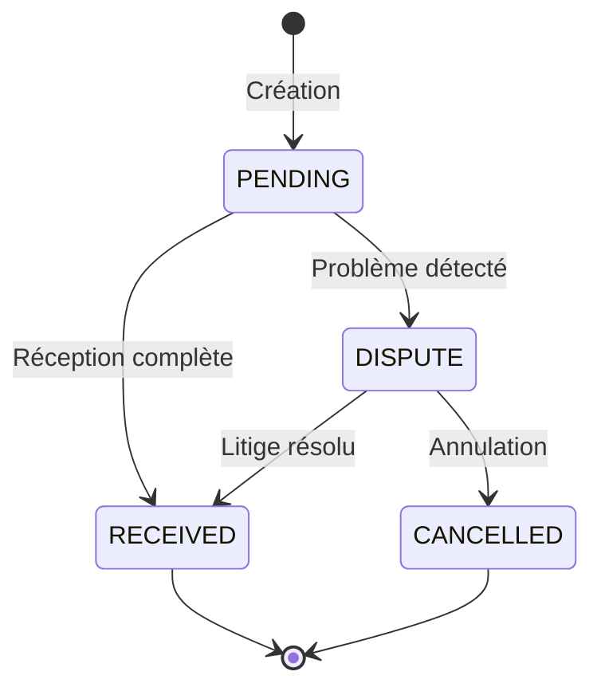
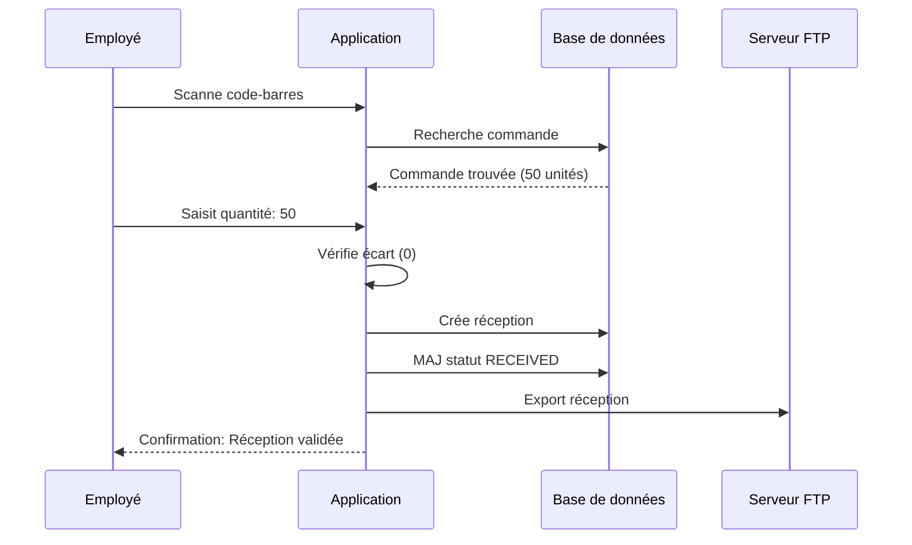
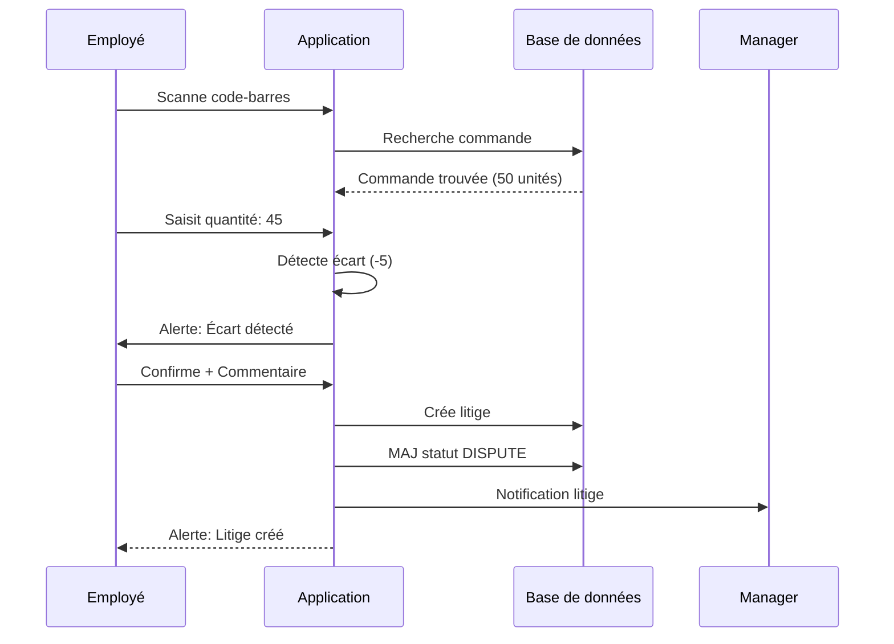
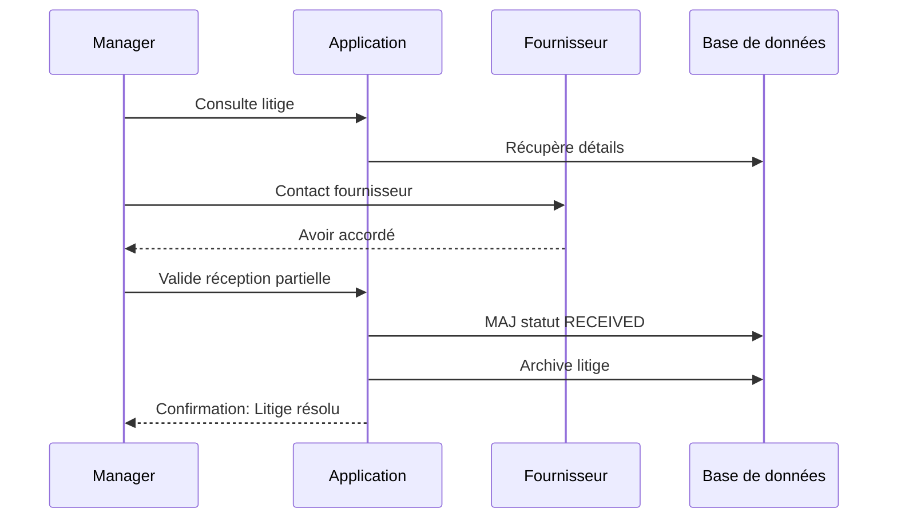

# Service de Gestion des Commandes

## Vue d'ensemble

Le service de gestion des commandes couvre l'ensemble du cycle de vie d'une commande : de sa création jusqu'à sa réception, en passant par le traitement des litiges éventuels.

---

## Cycle de Vie d'une Commande

### États de Commande



**Statuts disponibles :**
- **PENDING** : En attente de réception
- **RECEIVED** : Reçue et validée
- **DISPUTE** : Litige en cours
- **CANCELLED** : Annulée

---

## Création de Commandes

### Import Automatique

**Via fichier CSV/Excel :**
```csv
Code-barres,Quantité,Date de commande
3760123456789,50,2024-12-10
3760987654321,30,2024-12-10
3760555666777,100,2024-12-11
```

**Processus :**
1. Import du fichier
2. Validation des produits (existence en base)
3. Création/Mise à jour des commandes
4. Association au magasin
5. Création stock si inexistant
6. Rapport d'import généré

### Création Manuelle

**Interface utilisateur :**
```typescript
interface CreateOrderDto {
  productId: number;           // ID du produit
  quantity: number;            // Quantité commandée
  orderDate?: Date;            // Date (défaut: aujourd'hui)
  storeId?: number;           // Magasin (défaut: magasin utilisateur)
}
```

**Règles de création :**
- Quantité minimale : 1
- Produit doit exister
- Stock créé automatiquement si besoin
- Une commande par produit/date/magasin

---

## Réception de Commandes

### Processus de Réception

**Étapes :**

1. **Scan/Saisie du produit**
   - Code-barres ou recherche produit
   - Affichage quantité commandée

2. **Saisie quantité reçue**
   - Comptage physique
   - Validation de la quantité

3. **Détection d'écarts**
   ```typescript
   const difference = receivedQuantity - orderedQuantity;
   
   if (difference !== 0) {
     // Écart détecté → Litige potentiel
     showDisputeOption = true;
   }
   ```

4. **Enregistrement**
   - Création réception en base
   - Mise à jour statut commande
   - Génération export (si configuré FTP)

### Structure de Réception

```typescript
interface ReceptionData {
  orderId: number;             // ID de la commande
  receivedQuantity: number;    // Quantité réellement reçue
  comment?: string;            // Commentaire optionnel
  storeId?: number;           // Magasin destinataire
}
```

### Export Automatique

**Format TXT généré :**
```
[RECEPTION]
Date: 2024-12-11 14:30:00
Utilisateur: Jean Dupont
Magasin: Magasin Paris 01

[PRODUITS]
3760123456789|Café Arabica 1kg|48|50|2|Quantité inférieure
3760987654321|Thé Vert Bio 50g|30|30|0|OK

[TOTAUX]
Commandes réceptionnées: 2
Total attendu: 80
Total reçu: 78
Écart global: -2
```

**Contenu du fichier :**
- Date et heure de réception
- Utilisateur ayant réceptionné
- Détails par produit :
  - Code-barres
  - Nom produit
  - Quantité reçue
  - Quantité commandée
  - Écart
  - Commentaire

---

## Gestion des Litiges

### Création de Litige

**Déclenchement automatique :**
```typescript
// Si écart détecté lors de la réception
if (receivedQuantity !== orderedQuantity) {
  createDispute({
    orderId,
    receivedQuantity,
    comment: "Quantité reçue inférieure à la commande"
  });
}
```

**Création manuelle :**
```typescript
interface DisputeData {
  orderId: number;
  receivedQuantity: number;
  comment?: string;
  storeId?: number;
}
```

### Types de Litiges

**Causes fréquentes :**
- **Quantité inférieure** : Moins de produits que commandé
- **Quantité supérieure** : Plus de produits que commandé
- **Produits endommagés** : Colis abîmés
- **Produits manquants** : Absence totale
- **Produits erronés** : Mauvais produits livrés

### Export de Litige

**Format TXT :**
```
[LITIGE]
Date: 2024-12-11 15:00:00
Magasin: Magasin Paris 01

[DETAILS]
Commande: CMD001
Produit: 3760123456789 - Café Arabica 1kg
Quantité commandée: 50
Quantité reçue: 45
Écart: -5
Statut: DISPUTE

[COMMENTAIRE]
Cartons endommagés lors du transport.
5 unités inutilisables.

[ACTIONS]
- Nouvelle commande de 5 unités demandée
- Photos des dégâts conservées
- Fournisseur contacté
```

---

## Consultation et Reporting

### Filtrage des Commandes

**Critères disponibles :**
- Par statut (PENDING, RECEIVED, DISPUTE, CANCELLED)
- Par produit
- Par période (date de commande)
- Par magasin
- Avec/sans écart

**Exemples de requêtes :**
```typescript
// Commandes en attente
GET /orders?status=PENDING

// Commandes du mois
GET /orders?startDate=2024-12-01&endDate=2024-12-31

// Commandes avec litiges
GET /orders?status=DISPUTE

// Par magasin
GET /orders?storeId=1
```

### Exports Disponibles

**1. Export par Statut**
```csv
Code Commande,Code-barres,Nom Produit,Quantité,Statut,Date
CMD001,3760123456789,Café Arabica 1kg,50,PENDING,2024-12-10
CMD002,3760987654321,Thé Vert Bio 50g,30,RECEIVED,2024-12-09
CMD003,3760555666777,Chocolat Noir,100,DISPUTE,2024-12-08
```

**2. Export Toutes Commandes**
- Historique complet
- Tous statuts confondus
- Par magasin si spécifié

**3. Export Commandes Reçues**
```csv
Code Commande,Produit,Qté Commandée,Qté Reçue,Écart,Date Réception
CMD002,Thé Vert Bio 50g,30,30,0,2024-12-09 14:30
CMD004,Huile d'Olive,20,20,0,2024-12-10 10:15
```

---

## Processus Complets

### Cas 1 : Réception sans Problème



### Cas 2 : Réception avec Écart



### Cas 3 : Résolution de Litige



---

## Indicateurs et KPIs

### Métriques Disponibles

**Par magasin :**
- Nombre de commandes en attente
- Taux de réception complète
- Nombre de litiges en cours
- Temps moyen de réception
- Écarts moyens (quantités)

**Par période :**
- Volume de commandes
- Évolution des litiges
- Performance fournisseurs
- Taux de conformité

**Par fournisseur :**
- Fiabilité des livraisons
- Taux d'écarts
- Délais de livraison

---

## Permissions et Sécurité

### Droits par Rôle

| Action | Employé | Manager | Admin |
|--------|---------|---------|-------|
| Voir commandes magasin | Oui | Oui | Oui |
| Voir toutes commandes | Non | Non | Oui |
| Créer commande | Non | Oui | Oui |
| Réceptionner | Oui | Oui | Oui |
| Créer litige | Oui | Oui | Oui |
| Résoudre litige | Non | Oui | Oui |
| Annuler commande | Non | Oui | Oui |
| Exporter | Non | Oui | Oui |

### Isolation des Données

**Règle :** Chaque magasin ne voit que ses commandes

**Exception :** Les administrateurs voient tout

---

## Configuration

### Import Automatique

**Mapping colonnes :**
```typescript
{
  "Code-barres": "barcodeValue",
  "Quantité": "ordersQuantity",
  "Date de commande": "ordersDate"
}
```

**Planification :**
- Import FTP automatique
- Fréquence configurable
- Détection format automatique

### Export Automatique

**Configuration FTP :**
```typescript
{
  type: 'export',
  remoteDir: '/exports/orders',
  protocol: 'sftp',
  storeId: 1
}
```

**Déclenchement :**
- À chaque réception
- À chaque litige
- Export planifié (fin de journée)

---

## Résolution de Problèmes

### Erreurs Courantes

**1. "Produit avec barcode X non trouvé"**
```
Cause: Import de commande pour produit inexistant
Solution: Importer d'abord les produits, puis les commandes
```

**2. "Une commande existe déjà pour ce produit et cette date"**
```
Cause: Doublon dans le fichier d'import
Solution: Nettoyer le fichier ou utiliser mise à jour
```

**3. "Stock créé automatiquement"**
```
Info: Stock créé si inexistant lors de l'import
Action: Vérifier que le magasin est correct
```

**4. "Impossible de créer la réception"**
```
Cause: Commande déjà reçue ou annulée
Solution: Vérifier le statut de la commande
```

---

## Bonnes Pratiques

### À Faire

1. **Importer régulièrement** : Synchroniser les commandes quotidiennement
2. **Réceptionner rapidement** : Dans les 24h de la livraison
3. **Documenter les écarts** : Commentaires détaillés pour litiges
4. **Vérifier les quantités** : Double comptage si écart
5. **Suivre les litiges** : Résolution dans les 48h

### À Éviter

1. **Reporter les réceptions** : Risque d'oubli
2. **Ignorer les petits écarts** : Accumulation problématique
3. **Commentaires vagues** : Compliquer la résolution
4. **Valider sans compter** : Source d'erreurs
5. **Oublier les photos** : Preuve pour litiges

---

## Optimisation

### Performance

**Imports volumineux :**
- Traitement par lots de 1000
- Import asynchrone possible
- Rapport détaillé généré

**Exports :**
- Format TXT optimisé
- Compression automatique si >100 lignes
- Upload FTP en arrière-plan

### Notifications

**Alertes automatiques :**
- Email manager si litige
- Notification si commande urgente
- Rappel si commande non reçue >7 jours

---

## Support

**Questions sur les commandes ?**
- Email : support-commandes@votre-entreprise.com
- Chat : Disponible dans l'application
- Hotline : +33 X XX XX XX XX

**Documentation complémentaire :**
- [Guide Import Commandes](../guides/import-orders.md)
- [Gestion des Litiges](../guides/disputes.md)
- [Réception Rapide](../guides/quick-reception.md)

---

## Liens Utiles

- [Import/Export](import-export.md)
- [Gestion des Stocks](stock-management.md)
- [Configuration FTP](ftp-sync.md)
- [API Reference](../api/products-orders.md)