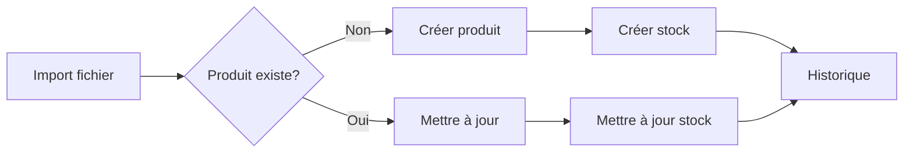

# Service de Gestion des Stocks

## Vue d'ensemble

Le service de gestion des stocks permet un suivi en temps réel des inventaires à travers plusieurs magasins et entrepôts. Il constitue le cœur de votre système logistique.

---

## Fonctionnalités principales

### 1. Suivi Multi-Emplacements

**Deux niveaux de stock :**
- **Stock Magasin** : Produits disponibles en rayon
- **Stock Entrepôt** : Réserve disponible

**Mise à jour en temps réel :**
- Synchronisation automatique lors des imports
- Mise à jour manuelle possible
- Historique complet des mouvements

### 2. Gestion des Produits

**Informations suivies :**
```typescript
{
  productCode: string;        // Code interne
  barcodeValue: string;        // Code-barres
  productName: string;         // Nom du produit
  priceCaisse: number;         // Prix caisse
  priceGestcom: number;        // Prix Gestcom
  stockQuantityStore: number;  // Quantité magasin
  stockQuantityWarehouse: number; // Quantité entrepôt
}
```

### 3. Liens avec Entités

**Relations gérées :**
- **Fournisseurs** : Association produit-fournisseur
- **Magasins** : Stock par point de vente
- **Entrepôts** : Réserve centralisée
- **Utilisateurs** : Traçabilité des modifications

---

## Processus de Gestion

### Création/Mise à jour de Stock



### Recherche et Normalisation

**Normalisation des codes-barres :**
- Suppression des zéros non significatifs
- Gestion notation scientifique
- Limitation à 20 caractères
- Détection des doublons

**Exemple de normalisation :**
```javascript
Input:  "0000012345" ou "1.2345e+4"
Output: "12345"
```

---

## Fonctionnalités Avancées

### 1. Historique des Mouvements

Chaque modification de stock est tracée :
- Date et heure du changement
- Utilisateur responsable
- Quantités avant/après
- Type de mouvement (import, manuel, commande)

### 2. Détection d'Anomalies

**Le système détecte automatiquement :**
- Quantités négatives
- Prix incohérents
- Codes-barres dupliqués dans un fichier
- Produits sans stock ni fournisseur

### 3. Règles de Gestion

**Contraintes métier :**
```typescript
// Les quantités ne peuvent être négatives
if (stockQuantity < 0) {
  throw new Error('Stock négatif non autorisé');
}

// Prix minimum à 0
if (price < 0) {
  throw new Error('Prix négatif non autorisé');
}

// Code-barres unique par produit
// Un seul stock par combinaison produit-magasin-entrepôt
```

---

## Cas d'Usage Pratiques

### Cas 1 : Import quotidien automatique

**Contexte :** Synchronisation nocturne depuis l'ERP

**Processus :**
1. Import automatique FTP à 2h du matin
2. Détection produits nouveaux vs existants
3. Mise à jour des stocks
4. Génération rapport d'import
5. Email récapitulatif si erreurs

**Résultat :** Stocks actualisés chaque matin

### Cas 2 : Ajout manuel d'un nouveau produit

**Contexte :** Produit en magasin non référencé

**Processus :**
1. Manager scanne le code-barres
2. Saisit les informations (nom, prix)
3. Définit les quantités magasin/entrepôt
4. Associe un fournisseur (optionnel)
5. Valide la création

**Résultat :** Produit immédiatement disponible dans le système

### Cas 3 : Correction de stock

**Contexte :** Écart détecté après inventaire

**Processus :**
1. Employé signale l'écart
2. Manager vérifie et corrige
3. Système enregistre l'ajustement
4. Historique conserve la trace
5. Rapport d'écart généré si significatif

**Résultat :** Stock corrigé avec traçabilité complète

---

## Recherche et Consultation

### Critères de recherche disponibles

**Par produit :**
- Code produit
- Code-barres
- Nom (recherche partielle)

**Par localisation :**
- Magasin spécifique
- Entrepôt spécifique
- Multi-magasins (admin)

**Par fournisseur :**
- Tous les produits d'un fournisseur
- Stock par fournisseur

### Filtres avancés

```typescript
// Exemple de recherche multi-critères
{
  storeId: 1,
  productName: "café",
  hasStock: true,
  minQuantity: 10
}
```

---

## Interface Utilisateur

### Vue Liste de Stock

**Colonnes affichées :**
- Code produit
- Nom
- Code-barres
- Stock magasin
- Stock entrepôt
- Prix
- Fournisseur
- Dernière modification

**Actions disponibles :**
- Consulter détails
- Modifier quantités
- Générer étiquette
- Voir historique

### Vue Détail Produit

**Sections :**
- Informations générales
- Stocks par emplacement
- Historique des mouvements
- Commandes associées
- Litiges en cours

---

## Permissions et Sécurité

### Droits par rôle

| Action | Employé | Manager | Admin |
|--------|---------|---------|-------|
| Consulter stock | Oui | Oui | Oui |
| Modifier stock manuel | Non | Oui | Oui |
| Importer fichiers | Non | Oui | Oui |
| Supprimer produit | Non | Non | Oui |
| Voir historique complet | Non | Oui | Oui |
| Accès multi-magasins | Non | Non | Oui |

### Isolation des données

**Règle fondamentale :** Chaque magasin ne voit que ses propres données

**Exception :** Les administrateurs ont une vue globale de tous les magasins

---

## Indicateurs et Reporting

### KPIs disponibles

**Par magasin :**
- Nombre total de produits référencés
- Valeur totale du stock
- Produits en rupture
- Produits en surstock
- Rotation moyenne des stocks

**Exports possibles :**
- Liste complète des stocks (CSV/Excel)
- État des stocks à une date donnée
- Mouvements sur une période
- Écarts d'inventaire

---

## Configuration

### Paramètres système

```typescript
{
  // Seuil d'alerte rupture
  lowStockThreshold: 5,
  
  // Autoriser stocks négatifs (pour litiges)
  allowNegativeStock: false,
  
  // Notification automatique
  notifyOnLowStock: true,
  
  // Emails destinataires alertes
  alertEmails: ['manager@store.com']
}
```

### Import automatique

**Configuration FTP/SFTP :**
- Répertoire source
- Fréquence (toutes les X heures)
- Mapping des colonnes
- Règles de validation

---

## Gestion des Erreurs

### Erreurs courantes et solutions

**1. Code-barres dupliqué**
```
Erreur : "Code-barres 123456 présent plusieurs fois"
Solution : Vérifier le fichier source, corriger les doublons
```

**2. Produit non trouvé**
```
Erreur : "Produit avec barcode X non trouvé"
Solution : Créer d'abord le produit ou vérifier le code-barres
```

**3. Stock négatif**
```
Erreur : "Les quantités ne peuvent être négatives"
Solution : Vérifier les données, ajuster les quantités
```

**4. Magasin non configuré**
```
Erreur : "Magasin par défaut non trouvé"
Solution : Configuration FTP ou création manuelle du magasin
```

---

## Bonnes Pratiques

### À faire

1. **Importer régulièrement** : Synchronisez au moins une fois par jour
2. **Vérifier les imports** : Consultez les rapports d'import
3. **Nettoyer les données** : Supprimez les produits obsolètes
4. **Former les équipes** : Assurez-vous que tous comprennent le système
5. **Sauvegarder avant gros import** : Permet de revenir en arrière si besoin

### À éviter

1. **Import simultanés** : Attendez la fin d'un import avant d'en lancer un autre
2. **Modification manuelle pendant import** : Risque de conflits
3. **Codes-barres avec espaces** : Nettoyez vos données
4. **Ignorer les erreurs d'import** : Analysez et corrigez
5. **Stock manuel sans justification** : Utilisez les fonctions dédiées (réception, casse)

---

## Support

**Questions fréquentes :**
- Comment importer mon premier fichier ? → [Guide d'import](import-export.md)
- Comment corriger un stock erroné ? → Utilisez la fonction "Ajuster stock"
- Le code-barres ne fonctionne pas ? → Vérifiez la normalisation

**Besoin d'aide ?**
- Email : support-stock@votre-entreprise.com
- Chat : Disponible 7j/7 dans l'application
- Hotline : +33 X XX XX XX XX

---

## Liens Utiles

- [Guide d'import CSV/Excel](import-export.md)
- [Configuration FTP](ftp-sync.md)
- [Gestion des commandes](orders.md)
- [Inventaires](inventory.md)