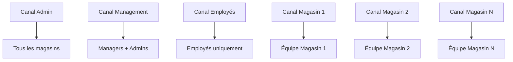
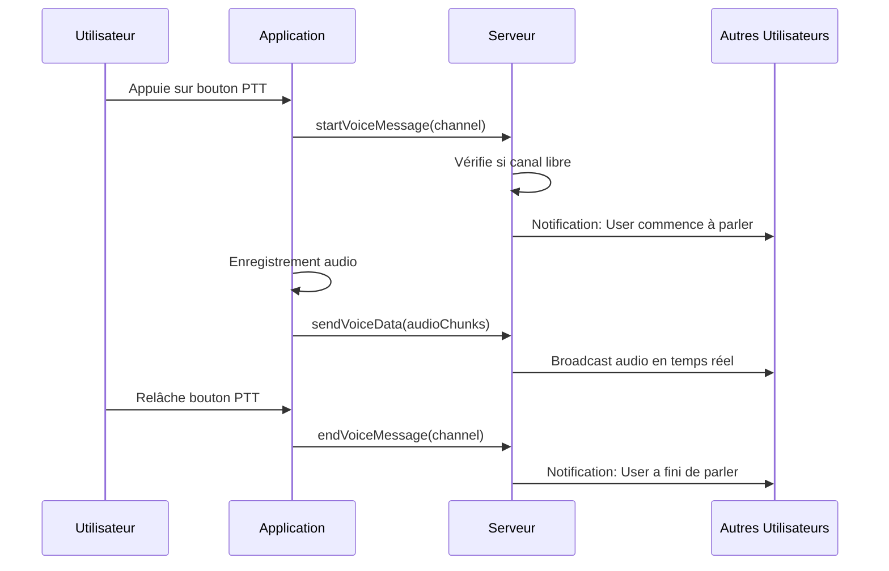

# Service de Communication Talkie-Walkie

## Vue d'ensemble

Le service Talkie-Walkie offre une communication vocale instantanée entre les membres de l'équipe, directement dans l'application. Plus besoin de talkies-walkies physiques : utilisez votre smartphone, tablette ou ordinateur.

---

## Fonctionnalités Principales

### Communication Temps Réel

**Caractéristiques :**
- **Audio instantané** : Transmission en temps réel
- **Sans latence** : Moins de 500ms de délai
- **Qualité HD** : Audio clair et net
- **Multi-plateforme** : Web, iOS, Android

### Gestion des Canaux

**Canaux hiérarchiques :**
- **Canal Magasin** : Communication au sein d'un point de vente
- **Canal Management** : Réservé aux managers et admins
- **Canal Employés** : Communication entre employés
- **Canal Admin** : Réservé aux administrateurs (tous magasins)

---

## Architecture du Système

### Structure des Canaux



### Permissions par Rôle

| Canal | Employé | Manager | Admin |
|-------|---------|---------|-------|
| Mon Magasin | Oui | Oui | Oui |
| Autres Magasins | Non | Non | Oui |
| Canal Employés | Oui | Non | Non |
| Canal Management | Non | Oui | Oui |
| Canal Admin | Non | Non | Oui |

---

## Utilisation du Service

### 1. Connexion

**Processus de connexion :**

```typescript
// L'utilisateur se connecte au talkie-walkie
POST /talkie-walkie/connect

Response:
{
  connectionId: "123_1702345678_abc",
  availableChannels: [
    {
      id: "store-1",
      displayName: "Mon Magasin",
      userCount: 5,
      currentSpeaker: null
    },
    {
      id: "management-channel",
      displayName: "Canal Management",
      userCount: 3,
      currentSpeaker: {
        userName: "Marie Martin",
        userRole: "MANAGER"
      }
    }
  ],
  connectedUsers: [
    { userName: "Jean Dupont", userRole: "EMPLOYEE" },
    { userName: "Sophie Bernard", userRole: "MANAGER" }
  ],
  selectedStore: { id: 1, name: "Magasin Paris 01" }
}
```

**Auto-join des canaux :**
- Employé → Canal magasin + Canal employés
- Manager → Canal magasin + Canal management
- Admin → Tous les canaux accessibles

### 2. Communication Vocale

**Flux de communication :**



**Règles de communication :**
- **Un seul locuteur à la fois** par canal
- **Durée maximale** : 30 secondes par message
- **Queue automatique** : Si quelqu'un parle, l'utilisateur est mis en attente
- **Interruption impossible** : Doit attendre la fin du message en cours

### 3. Types de Messages

#### Message vocal standard

```typescript
// Démarrer l'enregistrement
POST /talkie-walkie/voice/start
{
  "channel": "store-1"
}

// Envoyer les données audio
POST /talkie-walkie/voice/send
{
  "channel": "store-1",
  "audioData": "base64_encoded_audio",
  "duration": 5.2
}

// Terminer l'enregistrement
POST /talkie-walkie/voice/end
{
  "channel": "store-1"
}
```

#### Diffusion d'urgence

```typescript
POST /talkie-walkie/emergency
{
  "message": "Évacuation d'urgence du magasin",
  "audioData": "base64_encoded_audio",  // Optionnel
  "scope": "store",                      // ou 'global', 'role'
  "targetStoreId": 1,                    // Si scope='store'
  "targetRole": "MANAGER"                // Si scope='role'
}
```

**Priorités des diffusions :**
1. **Urgence globale** : Tous les utilisateurs, tous magasins
2. **Urgence magasin** : Tous les utilisateurs d'un magasin
3. **Urgence rôle** : Tous les utilisateurs d'un rôle spécifique

---

## Gestion de l'État

### État de Connexion

**Heartbeat automatique :**
```typescript
// Envoyé toutes les 30 secondes
POST /talkie-walkie/heartbeat
{
  "connectionId": "123_1702345678_abc"
}

Response:
{
  "isActive": true,
  "shouldReconnect": false
}
```

**Déconnexion automatique :**
- Après 90 secondes sans heartbeat
- L'utilisateur est retiré des canaux
- Notification envoyée aux autres utilisateurs

### Gestion des Speakers

**Contrôle d'exclusivité :**
```typescript
channelSpeakers: Map<string, ConnectedUser> = {
  "store-1": {
    userId: 123,
    userName: "Jean Dupont",
    speakingStartedAt: Date
  }
}
```

**Règles :**
- Un seul speaker actif par canal
- Libération automatique après 30s d'inactivité
- Libération manuelle possible

---

## Réception des Messages

### Mode Polling

**Pour clients sans SSE :**
```typescript
GET /talkie-walkie/messages?since=2024-12-11T10:00:00Z&channel=store-1

Response:
{
  voiceMessages: [
    {
      id: "msg_123",
      senderId: 456,
      senderName: "Sophie Bernard",
      senderRole: "MANAGER",
      channel: "store-1",
      audioData: "base64_audio",
      timestamp: "2024-12-11T10:05:23Z",
      duration: 4.5,
      storeId: 1
    }
  ],
  emergencyMessages: [],
  events: []
}
```

**Optimisations :**
- Limite de polling : 1 requête toutes les 1.5s
- Messages filtrés par permissions
- Dédoublonnage automatique

### Mode SSE (Server-Sent Events)

**Pour temps réel optimal :**
```typescript
// Connexion SSE
GET /talkie-walkie/events

// Stream d'événements
data: {"type":"voice-data","audioData":"...","sender":{...}}

data: {"type":"user-connected","user":{...}}

data: {"type":"voice-message-started","channel":"store-1","speaker":{...}}

data: {"type":"emergency-broadcast","message":"..."}
```

**Événements diffusés :**
- `voice-data` : Données audio à lire
- `voice-message-started` : Quelqu'un commence à parler
- `voice-message-ended` : Quelqu'un a fini de parler
- `user-connected` : Nouvel utilisateur connecté
- `user-disconnected` : Utilisateur déconnecté
- `user-reconnected` : Utilisateur reconnecté
- `emergency-broadcast` : Message d'urgence

---

## Sécurité et Permissions

### Isolation par Magasin

**Règle fondamentale :**
```
Un employé/manager ne voit et n'entend QUE son magasin
Les admins ont accès à tous les magasins
```

**Vérification des permissions :**
```typescript
function canUserReceiveMessage(user, message): boolean {
  // Vérification du canal
  if (!isChannelAccessible(user, message.channel)) {
    return false;
  }
  
  // Vérification du magasin pour canaux store-X
  if (message.channel.startsWith('store-')) {
    const msgStoreId = parseInt(message.channel.split('-')[1]);
    
    // Admin peut tout voir
    if (user.userRole === 'ADMIN') {
      return true;
    }
    
    // Autres: seulement leur magasin
    return user.storeId === msgStoreId;
  }
  
  return true;
}
```

### Authentification

**JWT obligatoire :**
- Token valide requis pour toute action
- Token contient : userId, role, storeId
- Validation à chaque requête

**Connexions multiples :**
- Un utilisateur peut avoir plusieurs connexions
- Identifiant unique par connexion : `connectionId`
- Nettoyage automatique des anciennes connexions lors de reconnexion

---

## Monitoring et Statistiques

### Pour les Administrateurs

```typescript
GET /talkie-walkie/stats

Response:
{
  totalConnected: 45,
  byRole: {
    admin: 2,
    manager: 8,
    employee: 35
  },
  byStore: {
    1: 15,  // Magasin Paris 01
    2: 18,  // Magasin Lyon 05
    3: 12   // Magasin Marseille 03
  },
  channelActivity: {
    admin: 2,
    management: 8,
    employee: 35
  }
}
```

### Utilisateurs Connectés

```typescript
GET /talkie-walkie/users

Response:
[
  {
    userId: 123,
    userName: "Jean Dupont",
    userRole: "EMPLOYEE",
    storeId: 1,
    activeChannels: ["store-1", "employee-channel"],
    connectedAt: "2024-12-11T08:00:00Z",
    lastHeartbeat: "2024-12-11T10:30:45Z"
  }
]
```

### Statut d'un Canal

```typescript
GET /talkie-walkie/channel/store-1/status

Response:
{
  channelId: "store-1",
  userCount: 5,
  currentSpeaker: {
    userId: 456,
    userName: "Sophie Bernard",
    userRole: "MANAGER",
    speakingStartedAt: "2024-12-11T10:31:20Z"
  },
  canSpeak: false,  // Car quelqu'un parle déjà
  isJoined: true
}
```

---

## Configuration Avancée

### Paramètres Système

```typescript
{
  // Timeouts
  connectionTimeout: 90000,      // 90s sans heartbeat = déconnexion
  heartbeatInterval: 30000,      // Heartbeat toutes les 30s
  maxMessageDuration: 30000,     // 30s max par message
  
  // Limites
  maxConcurrentUsers: 1000,      // Par serveur
  maxChannelsPerUser: 10,
  minPollInterval: 1500,         // 1.5s entre chaque poll
  
  // Rétention
  messageRetention: 300000,      // 5 minutes
  historyRetention: 3600000,     // 1 heure
  
  // Audio
  audioFormat: 'webm',
  audioCodec: 'opus',
  sampleRate: 48000,
  bitrate: 32000                 // 32kbps
}
```

### Nettoyage Automatique

**Tâches programmées :**

```typescript
// Toutes les 30 secondes
cleanupInactiveConnections() {
  // Retire les utilisateurs inactifs > 90s
  // Libère les canaux bloqués
  // Nettoie les subscriptions orphelines
}

cleanupOldMessages() {
  // Supprime les messages > 5 minutes
  // Nettoie les IDs traités > 10 minutes
  // Libère la mémoire
}
```

---

## Résolution de Problèmes

### Problèmes Courants

**1. "Je n'entends personne"**

**Causes possibles :**
- Pas connecté au bon canal
- Volume du système trop bas
- Problème de permissions navigateur

**Solutions :**
```typescript
// Vérifier la connexion
GET /talkie-walkie/status
// Vérifier les canaux actifs
GET /talkie-walkie/users
// Tester la réception
GET /talkie-walkie/messages?since=...
```

**2. "Je ne peux pas parler"**

**Causes possibles :**
- Quelqu'un parle déjà sur le canal
- Micro non autorisé
- Connexion perdue

**Solutions :**
```typescript
// Vérifier le statut du canal
GET /talkie-walkie/channel/:id/status

// Si currentSpeaker != null → attendre
// Si canSpeak === false → pas les permissions
// Si isJoined === false → rejoindre le canal
```

**3. "Déconnexions fréquentes"**

**Causes possibles :**
- Connexion réseau instable
- Heartbeat non envoyé
- Multiple connexions simultanées

**Solutions :**
```typescript
// Vérifier la connexion
POST /talkie-walkie/heartbeat

// Si shouldReconnect === true
POST /talkie-walkie/connect
```

**4. "Messages reçus en double"**

**Cause :** Multiple connexions actives

**Solution :**
```typescript
// Se déconnecter proprement
POST /talkie-walkie/disconnect

// Attendre 2 secondes
// Se reconnecter
POST /talkie-walkie/connect
```

---

## Optimisation des Performances

### Bonnes Pratiques Client

**1. Utiliser SSE plutôt que polling**
```typescript
// Meilleure approche
const eventSource = new EventSource('/talkie-walkie/events');

// À éviter sauf si SSE impossible
setInterval(() => fetch('/talkie-walkie/messages'), 1500);
```

**2. Gérer proprement les déconnexions**
```typescript
window.addEventListener('beforeunload', () => {
  fetch('/talkie-walkie/disconnect', { method: 'POST' });
});
```

**3. Heartbeat régulier**
```typescript
setInterval(async () => {
  const response = await fetch('/talkie-walkie/heartbeat', {
    method: 'POST',
    body: JSON.stringify({ connectionId })
  });
  
  const data = await response.json();
  if (data.shouldReconnect) {
    // Reconnecter
  }
}, 30000);
```

### Optimisations Serveur

**Mémoire :**
- Messages gardés 5 minutes max
- IDs traités nettoyés après 10 minutes
- Connexions inactives supprimées après 90s

**Broadcasting intelligent :**
- Filtrage par permissions avant envoi
- Pas d'envoi au sender
- Broadcast par magasin pour isolation

**Audio :**
- Format Opus pour compression optimale
- Bitrate adaptatif selon qualité réseau
- Buffer côté client pour lecture fluide

---

## Cas d'Usage Réels

### Cas 1 : Communication en Rayon

**Contexte :** Un employé a besoin d'aide

**Processus :**
1. Employé appuie sur bouton talkie-walkie
2. Parle : "J'ai besoin d'aide au rayon fruits"
3. Manager entend et répond : "J'arrive dans 2 minutes"
4. Problème résolu rapidement

**Avantage :** Pas besoin de quitter son poste ou de chercher un talkie physique

### Cas 2 : Urgence Magasin

**Contexte :** Alerte de sécurité

**Processus :**
1. Manager détecte un problème
2. Envoie diffusion d'urgence magasin
3. Tous les employés du magasin entendent
4. Message texte + audio pour clarté
5. Équipe réagit immédiatement

**Avantage :** Communication instantanée à toute l'équipe

### Cas 3 : Coordination Multi-Magasins

**Contexte :** Admin doit annoncer une information importante

**Processus :**
1. Admin se connecte au canal admin
2. Envoie message vocal global
3. Tous les managers de tous les magasins entendent
4. Peuvent confirmer réception
5. Information diffusée en quelques secondes

**Avantage :** Communication uniforme et instantanée

---

## Intégration avec Autres Services

### Avec la Gestion des Stocks

**Scénarios :**
- "Stock épuisé de X, quelqu'un peut vérifier en réserve ?"
- "Réception arrivée, besoin de bras pour décharger"

### Avec les Commandes

**Scénarios :**
- "Commande urgente à préparer pour client"
- "Problème sur commande CMD123, manager demandé"

### Avec les Inventaires

**Scénarios :**
- "Inventaire rayon 5 terminé, résultats transmis"
- "Écart important détecté, vérification demandée"

---

## Support

**Problème de communication ?**
- Email : support-talkie@votre-entreprise.com
- Chat : Disponible 24/7
- Hotline : +33 X XX XX XX XX

**Documentation technique :**
- [API Reference](../api/talkie-walkie.md)
- [Guide d'intégration](../guides/talkie-integration.md)
- [Troubleshooting](../guides/talkie-troubleshooting.md)

---

## Liens Utiles

- [Configuration Audio](../guides/audio-setup.md)
- [Gestion des Permissions](../guides/permissions.md)
- [Architecture Temps Réel](../guides/realtime-architecture.md)